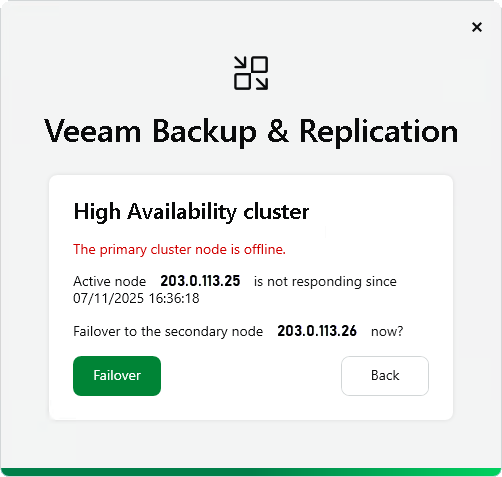

# Performing Failover

In this article

To initiate a failover, do the following:

1. Connect to the cluster using the cluster IP address.
2. The Veeam Backup & Replication console will display this warning: The primary cluster node is offline. The console will display information on how long the node has not been available.
3. Click Failover.

After the failover is completed, use the cluster IP address to connect to the cluster.

|  |
| --- |
| Important |
| Before you initiate a failover, ensure that the primary node is offline and will not revert to online status during the failover. Otherwise, it may lead to the split-brain scenarios. |

Page updated 11/14/2025

Page content applies to build 13.0.1.1071
