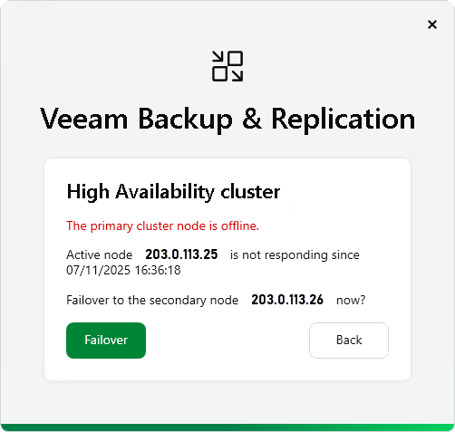

# Performing Failover

To initiate a failover, do the following:

1. Connect to the cluster. For a standard HA cluster, use the cluster IP address or cluster hostname. For a cross-subnet HA cluster, use the cluster DNS name.
2. The Veeam Backup & Replication console displays this warning: The primary cluster node is offline. The console will display information on how long the node has not been available.
3. Click Failover.

After the failover is completed, connect to the cluster again using the same address you used at step 1.

|  |
| --- |
| Important |
| Consider the following:   * Before you initiate a failover, ensure that the primary node is powered off. Keep the primary node powered off from the moment the failover prompt appears until the failover completes and the console reconnects to the new primary node. If the old primary node is powered on during this period, a split-brain scenario may occur. * If the secondary node is not fully synchronized with the primary node, Veeam Backup & Replication displays a dialog and prompts you to choose one of the following: fail over and lose the non-replicated data, or cancel the failover. |

Page updated 2026-07-17

