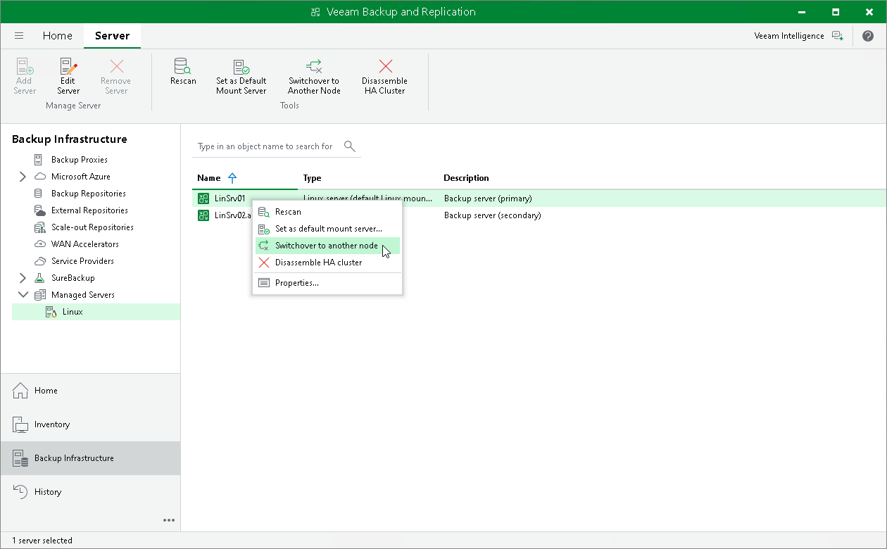

# Performing Switchover

In this article

To initiate a switchover, do the following:

1. Open the Backup Infrastructure view.
2. In the [inventory pane](vbr_ui.md), select the Managed Servers node and right-click the necessary node.
3. In the working area, select the necessary Veeam Software Appliance and click Switchover to Another Node on the ribbon. Alternatively, right-click the necessary Veeam Software Appliance and select Switchover to another node.

Page updated 1/13/2026

Page content applies to build 13.0.1.1071
