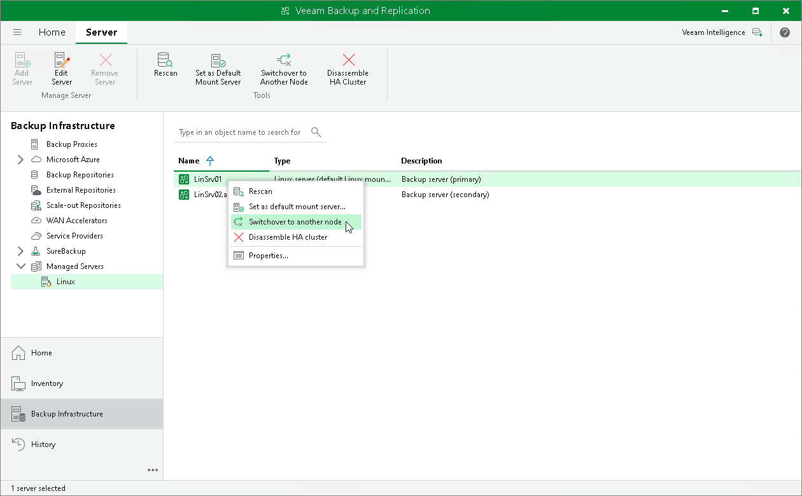

# Performing Switchover

To initiate a switchover, do the following:

1. Open the Backup Infrastructure view.
2. In the [inventory pane](vbr_ui.md), select the Managed Servers node and right-click the necessary node.
3. In the working area, select the necessary Veeam Software Appliance and click Switchover to Another Node on the ribbon. Alternatively, right-click the necessary Veeam Software Appliance and select Switchover to another node.

|  |
| --- |
| Important |
| If the secondary node is not fully synchronized with the primary node, Veeam Backup & Replication displays a dialog and prompts you to choose one of the following: switch over and lose the non-replicated data, or cancel the switchover. |

Page updated 2026-07-17

