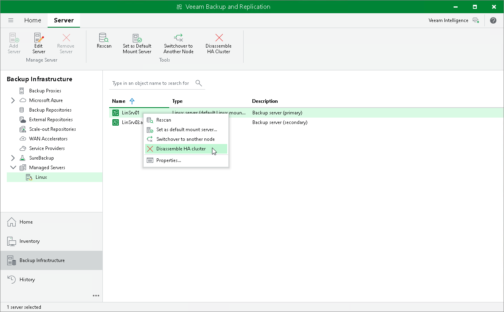

# Disassembling High Availability Cluster

After you initiate the cluster disassembly procedure, Veeam Backup & Replication removes the configuration database from the secondary node. After you disassemble an HA cluster, Veeam Backup & Replication stops synchronizing the nodes; however, the certificates and files remain in the same state they were in before the disassembly.

|  |
| --- |
| Important |
| You cannot use the secondary node as a standalone backup server after you disassemble an HA cluster. |

To disassemble an HA cluster, do the following:

1. Open the Backup Infrastructure view.
2. In the [inventory pane](vbr_ui.md), select Managed Servers.
3. In the working area, select the Linux host and click Disassemble HA Cluster on the ribbon. Alternatively, you can right-click the necessary host and select Disassemble HA Cluster.

