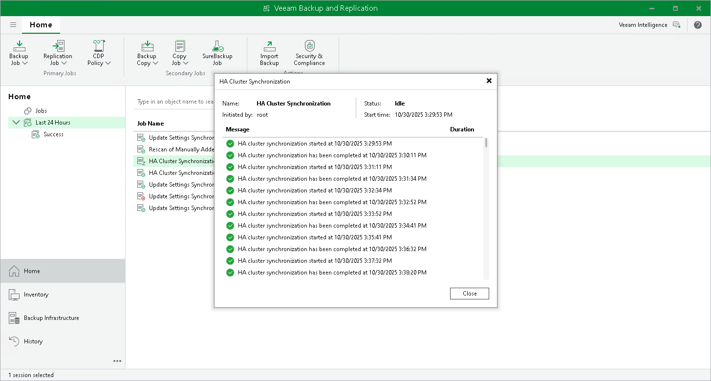

# Viewing Session Statistics and Results

In this article

Veeam Backup & Replication allows you to view real-time statistics and session results for an HA cluster

To view real-time statistics for an HA cluster, open the Home view. In the inventory pane, select Last 24 hours or Running. In the working area, double-click the HA cluster Synchronization.

The statistics provide detailed data on HA cluster sessions: creation, synchronization, switchover, failover, and disassemble of an HA cluster.

Page updated 11/14/2025

Page content applies to build 13.0.1.1071
