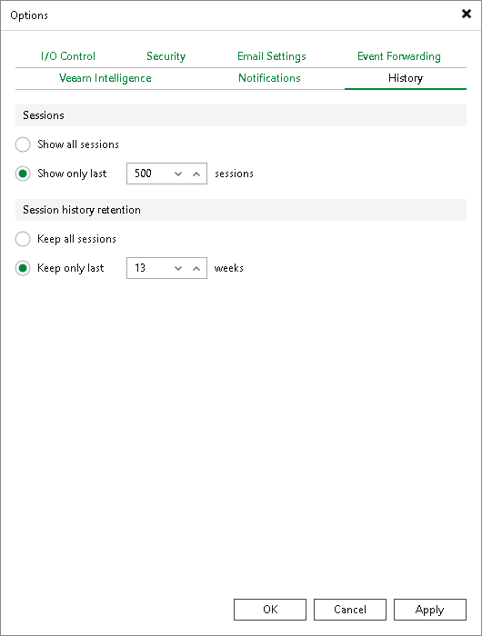

# Specifying Session History Settings

In this article

You can specify session history settings for jobs performed on the backup server.

1. From the main menu, select Options.
2. Click the History tab.
3. In the Sessions section, configure how many sessions you want to display in the Sessions list of the [History](vbr_ui.md#views) view:

* Select Show all sessions if you want to show all sessions.
* Select Show only last sessions if you want to show a limited number of sessions. In the field, also specify the total number of sessions that you want to display.

1. In the Session history retention section, configure for how long you want to keep session information in the database:

* Select Keep all sessions if you do not want to delete sessions.
* Select Keep only last weeks if you want to keep sessions for a limited period of time. In the field, also specify this period in weeks.

Page updated 7/21/2025

Page content applies to build 13.0.1.1071
