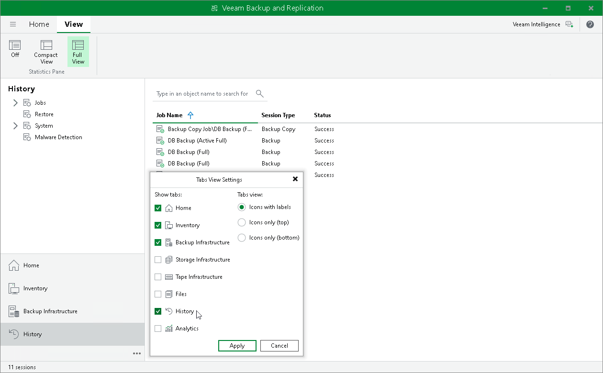

# Viewing History Statistics

In this article

The History view displays statistics for operations performed with Veeam Backup & Replication: backup and restore jobs, system operations, retention jobs and malware detection sessions. The History view shows data for all sessions stored in the configuration database.

To view the history of jobs and operations performed by Veeam Backup & Replication:

1. Click the three dots icon () at the bottom of the navigation pane.
2. Click History in the list and then Apply.
3. Select one of the following nodes: Jobs, Restore, System or Malware Detection.

The History view provides overall session statistics: name, status, start and end time, who initiated the session, and session type. To view detailed data on each session, double-click the session in the working area or right-click it and select Statistics. For backup and backup copy jobs, you can switch between Compact View and Full View modes within the View tab on the ribbon to hide or show job details.

|  |
| --- |
| Tip |
| Consider the following:   * The History view can be shown as an icon if it does not fit into the pane. To show the History view in the full size, drag and drop the upper border of the pane. * You can configure the period for which Veeam Backup & Replication shows sessions as described in [Specifying Session History Settings](history_settings.md). |

Page updated 7/28/2025

Page content applies to build 13.0.1.1071
