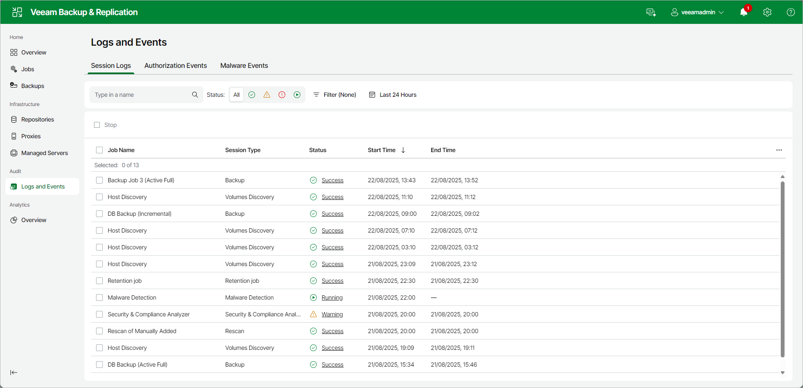

# Viewing Logs and Events

In this article

The Logs and Events view displays system and job event logs. This view shows data for all sessions stored in the configuration database.

To view the history of jobs and operations performed by Veeam Backup & Replication open Logs and Events node in the management pane and select one of the following tabs: Session Logs, Authorization Events or Malware Events.

The Session Logs view provides overall session statistics: name, session type, status, start and end time and who initiated the session. To view detailed data on each session, click the Status link.

|  |
| --- |
| Tip |
| Consider the following:   * To configure the period for which Veeam Backup & Replication shows sessions, click Last 24 Hours and specify the time range. * To configure which job or restore types should be displayed in the list, click Filter and specify what you want to show. |

Page updated 8/25/2025

Page content applies to build 13.0.1.1071
