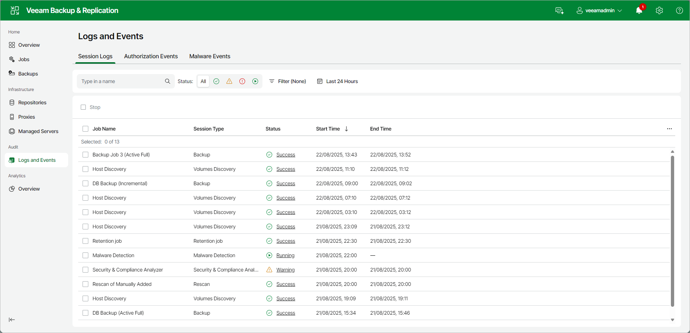

# Viewing Logs and Events

The Logs and Events view displays system and job event logs. This view shows data for sessions of the job and operation types supported in the Web UI.

To view the history of jobs and operations performed by Veeam Backup & Replication open the Logs and Events node in the management pane and select one of the following tabs: Session Logs, Events or Malware Events.

The Session Logs view provides overall session statistics: name, session type, status, start and end time and who initiated the session. To view detailed data on each session, click the Status link.

The Events view displays audit events, such as changes to security settings, user and role management, approval of sensitive operations, and appliance events.

The Malware Events view displays events created during malware detection activities, such as guest indexing data scans, inline scans, Scan Backup sessions, secure restores, and proactive signature-based scans.

|  |
| --- |
| Tip |
| Consider the following:   * To configure the period for which Veeam Backup & Replication shows sessions, click Last 24 Hours and specify the time range. * To configure which job or restore types should be displayed in the list, click Filter and specify what you want to show. |

Page updated 2026-07-22

