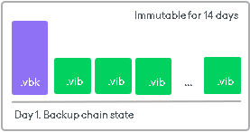
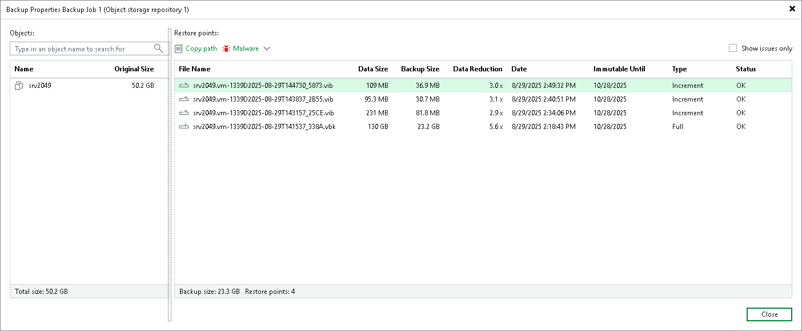

# How Immutability Works

Immutability is the state of data that prevents it from being modified or deleted. Veeam Backup & Replication applies immutability to the state of a backup chain within a certain period of time. After you enable immutability, Veeam Backup & Replication prohibits deleting data from object storage repositories until the immutability expiration date comes. Immutability settings configured for object storage repository are applied to the whole backup chain and all its restore points.

To make data immutable, Veeam Backup & Replication utilizes the technology that prevents data from deletion and allows you to keep several versions of objects. The selected technology depends on the type of object storage:

* Object lock and Versioning — for Amazon S3 Storage, S3 Compatible, IBM Cloud, Wasabi Cloud, 11:11 Cloud Object Storage, Google Cloud Storage.
* Version-level WORM and blob versioning — for Azure Storage.

For more information, see [Enabling Immutability](immutability_os_enable.md).

How Immutability Works

With every run of a backup job, new restore points are created. The restore points contain unique and inherited data blocks, to which Veeam Backup & Replication assigns the immutability period according to the object storage settings. The restore points with immutable data are visible in the Veeam Backup & Replication UI for the whole period of their immutability protection. After the immutability period of the specific block expires, this block is deleted from the object storage repository.

Immutability retention works the following way:

1. On 07/01/25, during the first run of a backup job, Veeam Backup & Replication creates the first restore point. This restore point consists of a VBK (full backup file) that contains unique blocks A, B, and C. Veeam Backup & Replication assigns these blocks an immutability period of 7 days. Block Generation is 10 days.
2. On 07/02/25, during the second run of a backup job, Veeam Backup & Replication creates the second restore point. This restore point consists of a VIB (an incremental backup file) containing blocks A and B inherited from the VBK, and a new unique block D. This block is immutable for 7 days and replaces block A.
3. On 07/18/25 the immutability period for block A expires, and Veeam Backup & Replication removes it from the object storage repository. After that, Veeam Backup & Replication deletes metadata associated with this block.

Checking Immutability Period

All immutable backup files are visible in the Veeam Backup & Replication UI for the period of their immutability protection. To view immutability period for backup files, perform the following steps:

1. Open the Home view.
2. In the [inventory pane](vbr_ui.md), select Backups.
3. In the working area, right-click the backup and select Properties.
4. To see the list of available restore points, select the required object from the Objects list.

Object Storage Actual Retention

When you configure an object storage repository and enable immutability, the actual retention of the backup files will depend on the configuration of your object storage repository. You can specify the immutability period to be the same as the retention of a backup job or depend on the minimum immutability period only. In both cases, you can specify the immutability period explicitly. Therefore, you can select one of the following options to set up the immutability period:

* For the entire duration of their retention policy. In this case, backups will be immutable for a period defined by the retention policy of a backup job. Consider that Veeam Backup & Replication will count the actual retention of the backups differently in the following cases:

* If the job retention exceeds the minimum immutability period, the actual retention is counted as job retention policy + Block Generation period.
* If the minimum immutability period exceeds the job retention period, the actual retention is counted as the minimum immutability period + Block Generation period.

|  |
| --- |
| Important |
| Veeam Backup & Replication does not support this configuration for object storage repositories used as capacity tier extents. If you add an object storage repository with this configuration as the capacity extent, Veeam Backup & Replication will switch it to the minimum immutability period retention. |

* For the minimum immutability period only. In this case, the backup files are immutable for a period that you specify in the settings of the object storage repository + Block Generation period. The backup job retention will be ignored.

|  |
| --- |
| Important |
| For backups with GFS flags, VeeamZIP backups, and exported backup files, Veeam Backup & Replication applies the immutability period of the object storage repository. Retention of these backup files is not considered during the immutability period calculation. |

Thus, the actual retention of backups in the object storage repository depends on the algorithm that you choose when configuring immutability settings. Keep in mind that apart from the immutability period set for each object storage repository, Veeam Backup & Replication automatically adds several days to the immutability expiration date to reduce I/O operations and associated costs. This period is called Block Generation. You do not have to configure it; the Block Generation setting is applied automatically. For more information, see [Block Generation](object_storage_block_generation.md).

Depending on the retention configuration of your object storage repository, consider the following scenarios:

Scenario 1. Job Retention Longer Than Minimum Immutability Period

In this scenario, the retention is configured as follows:

* Job retention: 7 days
* The minimum immutability period: 3 days
* Block Generation: 10 days

Actual retention: 17 days. If the backup is run on 07/01/2025, the VBK file and any blocks that are not extended will be deleted on 07/18/2025.

Scenario 2. Job Retention Shorter Than Immutability Period

In this scenario, the retention is configured as follows:

* Job retention: 3 days
* The minimum immutability period: 7 days
* Block Generation: 10 days

Actual retention: 17 days. If the backup is run on 07/01/2025, the VBK file and any blocks that are not extended will be deleted on 07/18/2025.

Scenario 3. Job Retention Ignored

In this scenario, the retention is configured as follows:

* The minimum immutability period: 7 days
* Block Generation: 10 days

Actual retention: 17 days. If the backup is run on 07/01/2025, the VBK file and any blocks that are not extended will be deleted on 07/18/2025.

|  |
| --- |
| Important |
| Consider the following:   * Immutable backup files created in the previous versions of Veeam Backup & Replication are deleted according to the [former immutability model](https://helpcenter.veeam.com/docs/backup/vsphere/hiw_immutability_os.html?ver=120). * The type of the [backup method](backup_methods.md) affects the job retention policy and actual retention. For more information, see [Short-Term Retention Policy](retention_policy.md). * If you add an object storage repository as an extent of the performance tier, immutability depends on the scale-out backups repository configuration. For more information, see [Immutability for Performance Tier](immutability_performance_tier.md#dbos). |

