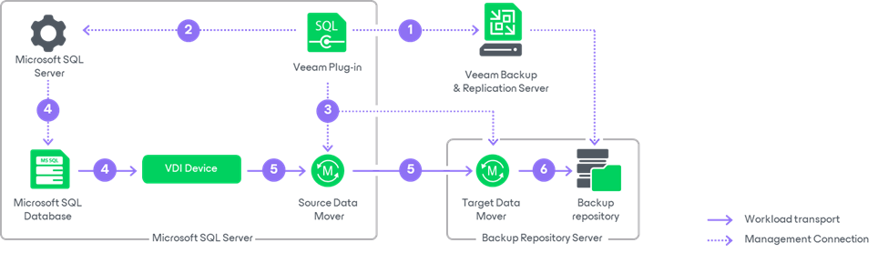
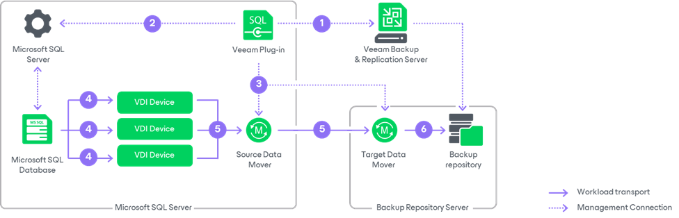
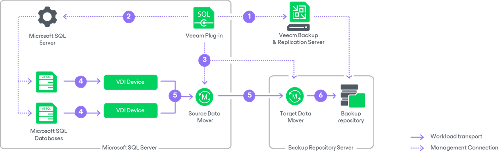

# How Veeam Plug-In for Microsoft SQL Server Works

Veeam Plug-In for Microsoft SQL Server performs backup of Microsoft SQL Server databases in the following way:

1. When the backup process is started for the first time, Veeam Plug-In connects to the Veeam Backup & Replication server and creates the backup job.
2. At the backup process start (upon schedule or manually), the MSSQLRecoveryManager service of Veeam Plug-In instructs Microsoft SQL Server to back up a database.
3. The MSSQLRecoveryManager service starts the source Veeam Data Mover on Microsoft SQL Server, and Veeam Backup Manager in Veeam Backup & Replication starts the target Veeam Data Mover on the Veeam backup repository.
4. Microsoft SQL Server starts the database backup process targeted at a VDI Device that is a virtual device that impersonates itself as a backup storage. For each backed-up database, a separate VDI Device is created. The number of VDI Devices also depends on the number of parallel data streams that you specify when configuring backup settings. For more information, see [Parallel Database Processing](#parallel).
5. The source Veeam Data Mover reads the backup data from VDI Devices and transfers it to the target Veeam Data Mover.
6. The target Veeam Data Mover writes the backup data to the backup repository.

Parallel Database Processing

Veeam Plug-In allows you to back up the same Microsoft SQL Server database in multiple parallel streams. To do this, you must specify the necessary number of data streams when configuring backup settings. For each data stream, a separate VDI Device is created.

If you back up multiple databases simultaneously, a separate VDI Device is created for each backed-up database.

