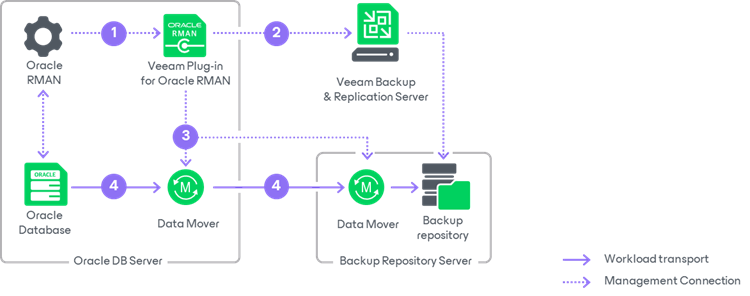
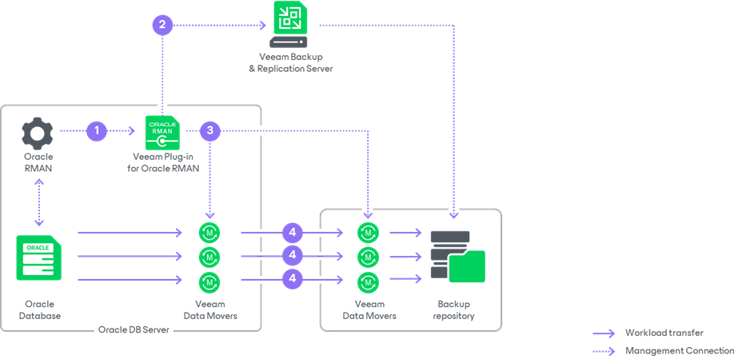

# How Veeam Plug-In for Oracle RMAN Works

Veeam Plug-In functions as an agent between Oracle RMAN and Veeam backup repository.

By default, RMAN sends backups to a native RMAN location on disk (DEFAULT DEVICE TYPE TO DISK). When you configure Veeam Plug-In, the default device type is changed to SBT\_TAPE, which gives control over backup media management to Veeam Plug-In. Thus, after you deploy Veeam Plug-In on an Oracle server, you can perform all backup and restore operations in the Oracle RMAN console. Veeam Plug-In compresses database backups and transfers them to a backup repository connected to Veeam Backup & Replication.

When use Oracle RMAN integrated with Veeam Plug-In, the database backup is performed in the following way:

1. After you launch a database backup process in the Oracle RMAN console, RMAN launches Veeam Plug-In services.
2. Veeam Plug-In connects to the Veeam Backup & Replication server and creates a backup job (if it hasn't been created earlier).
3. Veeam Plug-In starts Veeam Data Mover Service on the Oracle server and on the Veeam backup repository. Depending on the configured limit of RMAN channels, there will be multiple connections started in parallel.
4. Veeam Data Movers transport the backup data to the backup repository.

Multiple Repositories Deployment

Veeam Plug-In allows you to add up to 4 backup repositories. The backup process can be run in multiple channels. For each channel Veeam Plug-In creates a separate agent process.

