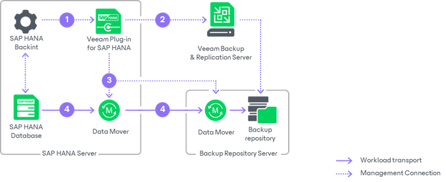

# How Veeam Plug-In for SAP HANA Works

Veeam Plug-In acts as an agent between an SAP HANA server and Veeam backup repositories. The plug-in interacts with databases through the SAP HANA Backint component. Backint for SAP HANA is the backup interface that enables Veeam Plug-In to communicate with the SAP HANA database and send the database backup files to the specified Veeam repositories.

Veeam Plug-In compresses database backups and transfers them to a backup repository connected to the Veeam Backup & Replication infrastructure. After you install and configure Veeam Plug-In on the SAP HANA server, you can perform all backup and restore operations with HDBSQL scripts, with native SAP HANA tools, such as SAP HANA Studio and SAP HANA Cockpit, and with Veeam Explorer for SAP HANA.

When Veeam Plug-In is configured, SAP Backint performs a database backup in the following way:

1. When you start a database backup, the SAP HANA Backint starts Veeam Plug-In services on the SAP HANA server.
2. Veeam Plug-In connects to the Veeam Backup & Replication server and creates a backup job (if it has not been created before). In the Veeam Backup & Replication console, Veeam backup administrators can use the backup job to monitor SAP HANA backups.
3. Veeam Plug-In starts Veeam Data Movers on the SAP HANA server and on a backup repository. According to a specified number of parallel Backint channels, Veeam Data Movers create channels to transfer backup data.
4. Veeam Data Movers transport backup data to the backup repository.

