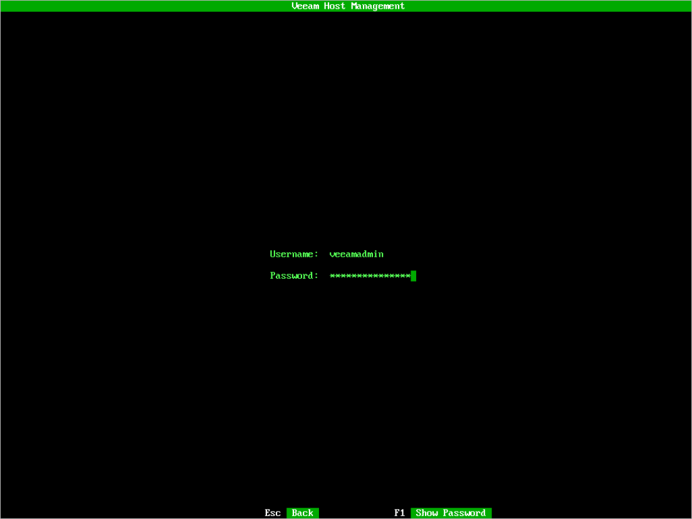

# Accessing Veeam Host Management Console

You can log in to the Veeam Host Management console under a user account with either the Host Administrator or Security Officer role.

During any Veeam appliance installation, the following user accounts are created:

* veeamadmin — a default user account with Host Administrator permissions.
* veeamso — a default user account with Security Officer permissions. The account can log in only to the Veeam Host Management web UI. This account is available only if you configured it during the Initial Configuration wizard. For details, see [Configure Security Officer Account](deployment_linux_iso_install_security_officer.md).

A Host Administrator can add additional user accounts to grant access to Veeam Host Management. For more information, see [Managing Users and Roles](hmc_users.md).

|  |
| --- |
| Note |
| User accounts are locked after three failed login attempts. For more information on how to unlock them, see [Unlocking Users](hmc_manage_user_auth.md#unlock_user). |

Logging in to Web UI

To log in to the Veeam Host Management web UI, do the following:

1. In your web browser, navigate to the Veeam Host Management URL. The URL consists of an FQDN or IP address of the server where the backup infrastructure component is installed, and the Veeam Host Management port. For example, https://vbrsrv01.tech.local:10443.

|  |
| --- |
| Note |
| The Veeam Host Management web UI does not support the following browser versions:   * Google Chrome — version 118 and earlier * Microsoft Edge — version 118 and earlier * Google Chrome — version 118 and earlier |

1. Select a language. This choice applies only to the current session and does not change your saved user settings.
2. Specify user credentials with Host Administrator or Security Officer permissions.

|  |
| --- |
| Tip |
| If you have forgotten the password to your Host Administrator account, you can request a remote password reset by clicking Forgot password?  This option is only available if the following is true:   * The appliance has a Security Officer account configured. * Remote password resets are enabled in the Password Policies menu. For more information, see [Configuring Password Policies](hmc_manage_user_auth.md#password_policies). |

1. Click Sign in.
2. If you enable multi-factor authentication (MFA) for the user, specify the confirmation code and click OK.

|  |
| --- |
| Note |
| If you skipped multi-factor authentication (MFA) configuration for veeamadmin during the appliance installation, you are prompted to set up MFA at first login to the Veeam Host Management console. Until you configure MFA, you cannot access Veeam Backup & Replication. |

Logging in to TUI

To log in to the Veeam Host Management TUI, do the following:

1. Connect to the server where the backup infrastructure component is installed through a physical console or a virtual remote console.

|  |
| --- |
| Note |
| You cannot log in to the Veeam Host Management TUI through SSH. |

1. Specify user credentials with Host Administrator permissions.

|  |
| --- |
| Tip |
| To view the password, press [F1]. |

1. Press [Enter].
2. If you enabled multi-factor authentication (MFA) for the user, specify the confirmation code and press [OK].

|  |
| --- |
| Note |
| If you skipped multi-factor authentication (MFA) configuration for veeamadmin during the appliance installation, you are prompted to set up MFA at first login to the Veeam Host Management console. Until you configure MFA, you cannot access Veeam Backup & Replication. |

Page updated 2026-07-21

