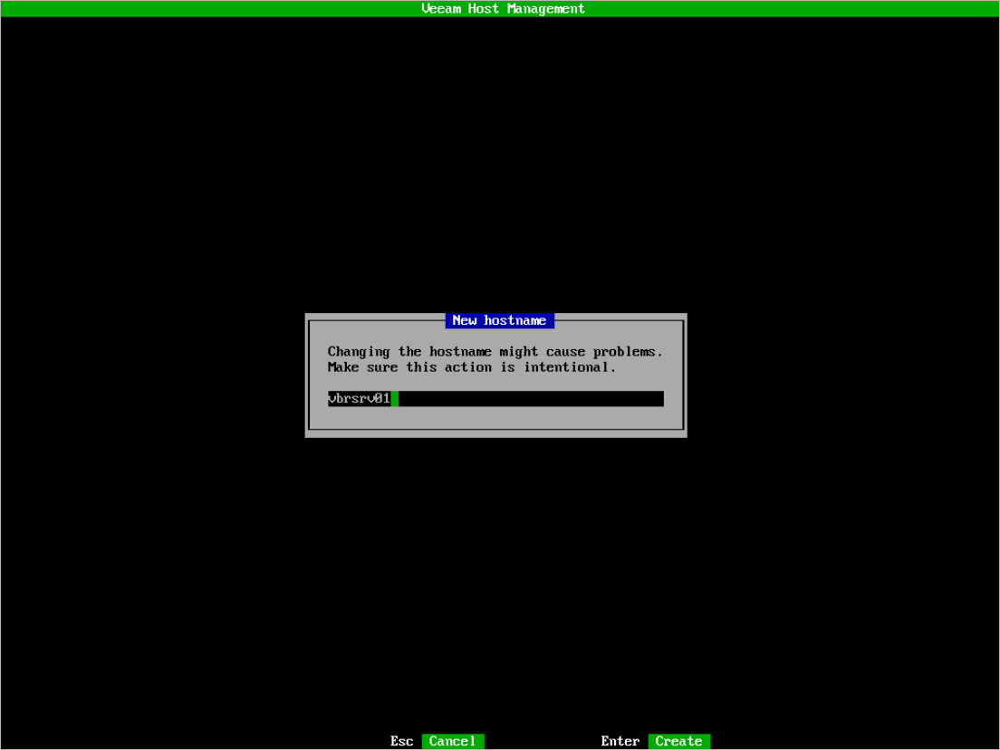

# Changing Server Name

Before you change the server name, consider the following:

* If the server is a part of the domain, remove the server from the domain first. For more information on how to do it, see [Managing Domain Settings](hmc_configure_domain.md).
* After you change the name, all services running on the server will be restarted. If you change the name of the backup server that has running jobs, backup or recovery operations performed by these jobs will fail.

If you use the Veeam Host Management web UI, perform the following steps:

1. Log in to the Veeam Host Management web UI as a Host Administrator.
2. In the management pane, click Network.
3. In the Hostname section, click Edit.
4. Specify a new server name.
5. Click OK.

If you use the Veeam Host Management TUI, perform the following steps:

1. Log in to the Veeam Host Management TUI as a Host Administrator.
2. In the main menu, select Host configuration > Hostname.
3. Specify a new server name and press [Enter].

