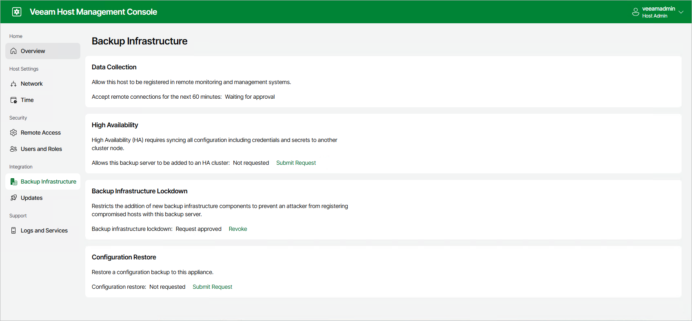
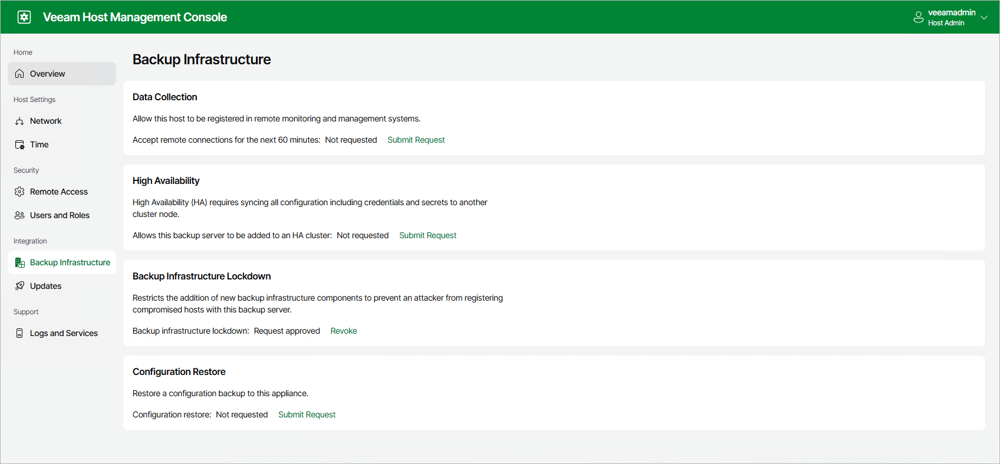

# Configuring Backup Infrastructure Settings

In this article

Users with Host Administrator permissions can perform the following operations with backup infrastructure:

* Enable remote data collection.
* Enable and disable backup infrastructure lockdown.
* Allow a backup server to be the part of the High Availability cluster. For more information, see [Enabling High Availability](high_availability_configuration_byb.md).
* Restore configuration database. For more information, see [Restoring Configuration Database using Veeam Host Management](vbr_config_restore_hmc.md).
* Configure pairing with the backup server for backup infrastructure components deployed from Veeam Infrastructure Appliance. For more information, see [Configuring Veeam Infrastructure Appliance](linux_infrastructure_appliance_configuring.md).

Enabling Remote Data Collection

By default, other Veeam monitoring and data management solutions including Veeam ONE, Veeam Recovery Orchestrator and Veeam Service Provider Console cannot install their agents on Veeam appliances. To allow this operation, perform the following steps:

1. Log in to the Veeam Host Management web UI as a Host Administrator.
2. In the management pane, click Backup Infrastructure.
3. In the Data Collection section, click Submit Request:

* If you did not configure the Security Officer account during the Veeam appliance installation, remote connections for Veeam Agents will be allowed immediately for 60 minutes.
* If you configured the Security Officer account, remote connections for Veeam Agents will be allowed for 60 minutes after the Security Officer approves the request.

If required, you can revoke permission before expiration. To do this, click Revoke.

Managing Backup Infrastructure Lockdown

After you configure your backup infrastructure, you can enable infrastructure lockdown to restrict adding new Microsoft Windows and Linux managed servers to the Veeam Backup & Replication console. This reduces the risk of adding compromised servers to your backup infrastructure.

|  |
| --- |
| Note |
| If you want to use remote data collection, you must install Veeam Agents before you enable infrastructure lockdown. |

To enable infrastructure lockdown, perform the following steps:

1. Log in to the Veeam Host Management web UI as a Host Administrator.
2. In the management pane, click Backup Infrastructure.
3. In the Backup Infrastructure Lockdown section, click Submit Request. Lockdown will be enabled immediately.

To disable lockdown, click Revoke. If you configured the Security Officer account, lockdown will be disabled after the Security Officer approves the request.

Page updated 12/16/2025

Page content applies to build 13.0.1.1071
