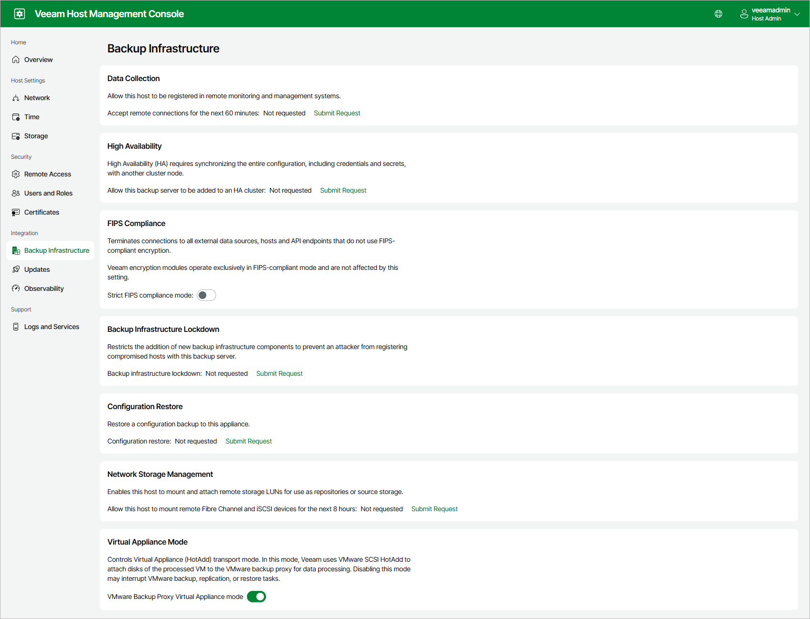

# Configuring Backup Infrastructure Settings

Users with Host Administrator permissions can perform the following operations with backup infrastructure:

* Enable remote data collection.
* Enable and disable backup infrastructure lockdown.
* Enable and disable FIPS-compliant operation mode.
* Enable network storage management to mount remote Fibre Channel and iSCSI devices.
* Enable and disable Virtual Appliance (HotAdd) transport mode.
* Enable an Application Backup repository on a Veeam Infrastructure Appliance with the Hardened Repository role.
* Allow a backup server to be the part of the High Availability cluster. For more information, see [Enabling High Availability](high_availability_configuration_byb.md).
* Restore configuration database. For more information, see [Restoring Configuration Database using Veeam Host Management](vbr_config_restore_hmc.md).
* Configure pairing with the backup server for backup infrastructure components deployed from Veeam Infrastructure Appliance. For more information, see [Configuring Veeam Infrastructure Appliance](linux_infrastructure_appliance_configuring.md).

Enabling Remote Data Collection

By default, other Veeam monitoring and data management solutions including Veeam ONE, Veeam Recovery Orchestrator and Veeam Service Provider Console cannot install their agents on Veeam appliances. To allow this operation, perform the following steps:

1. Log in to the Veeam Host Management web UI as a Host Administrator.
2. In the management pane, click Backup Infrastructure.
3. In the Data Collection section, click Submit Request:

* If you did not configure the Security Officer account during the Veeam appliance installation, remote connections for Veeam Agents will be allowed immediately for 60 minutes.
* If you configured the Security Officer account, remote connections for Veeam Agents will be allowed for 60 minutes after the Security Officer approves the request.

If required, you can revoke permission before expiration. To do this, click Revoke.

Managing FIPS Compliance

You can enable FIPS-compliant mode on the appliance to terminate connections to all external data sources, hosts, and API endpoints that do not use FIPS-compliant encryption. Veeam encryption modules always operate in FIPS-compliant mode and are not affected by this setting.

To enable or disable FIPS-compliant mode, perform the following steps:

1. Log in to the Veeam Host Management web UI as a Host Administrator.
2. In the management pane, click Backup Infrastructure.
3. In the FIPS Compliance section, set the Strict FIPS compliance mode toggle to the required position.
4. In the confirmation dialog, click Proceed:

* If you did not configure the Security Officer account during the Veeam appliance installation, the change will be applied immediately.
* If you configured the Security Officer account, the change will be applied after the Security Officer approves the request.

|  |
| --- |
| Note |
| Before enabling FIPS-compliance, consider the following:   * Enabling or disabling FIPS-compliant mode requires a server reboot. * In a High Availability cluster, FIPS-compliant mode is not synchronized between nodes automatically. If you change it on one node, you must apply the same change on the other node. * You cannot enable FIPS-compliance if the appliance is joined to an Active Directory domain. * NTS is not supported on appliances with FIPS-compliant mode enabled. You must configure an NTP server before enabling FIPS-compliant mode to avoid possible time synchronization issues. |

Managing Backup Infrastructure Lockdown

After you configure your backup infrastructure, you can enable infrastructure lockdown to restrict adding new Microsoft Windows and Linux managed servers to the Veeam Backup & Replication console. This reduces the risk of adding compromised servers to your backup infrastructure.

|  |
| --- |
| Note |
| If you want to use remote data collection, you must install Veeam Agents before you enable infrastructure lockdown. |

To enable infrastructure lockdown, perform the following steps:

1. Log in to the Veeam Host Management web UI as a Host Administrator.
2. In the management pane, click Backup Infrastructure.
3. In the Backup Infrastructure Lockdown section, click Submit Request. Lockdown will be enabled immediately.

To disable lockdown, click Revoke. If you configured the Security Officer account, lockdown will be disabled after the Security Officer approves the request.

Enabling Network Storage Management

You can enable network storage management to allow the Veeam appliance to mount and attach remote Fibre Channel and iSCSI LUNs. You can then use these LUNs as backup repositories or source storage. For more information on attaching storage, see [Managing Storage](hmc_manage_storage.md).

To enable network storage management, perform the following steps:

1. Log in to the Veeam Host Management web UI as a Host Administrator.
2. In the management pane, click Backup Infrastructure.
3. In the Network Storage Management section, click Submit Request:

* If you did not configure the Security Officer account during the Veeam appliance installation, the appliance will be allowed to mount remote devices immediately for 8 hours.
* If you configured the Security Officer account, the appliance will be allowed to mount remote devices for 8 hours after the Security Officer approves the request.

If required, you can revoke permission before expiration. To do this, click Revoke.

Enabling Application Backup Repository

On a Veeam Infrastructure Appliance with the Hardened Repository role, you can allow the appliance to function as a hardened repository and an application backup repository. After you enable it, you can select the Application Backup repository type when you add storage. For more information, see [Managing Storage](hmc_manage_storage.md) and [Application Backup Repositories](application_backup_repository.md).

When you enable an Application Backup repository, the appliance enables the NFS service, opens the required ports in the firewall, and lets the Application Backup repository package be installed from Veeam Backup & Replication. It also allows the appliance to be joined to a domain.

|  |
| --- |
| Important |
| Combining a Hardened repository with an Application Backup repository increases the attack surface on its immutability compared to using a standalone Veeam Hardened Repository. |

To enable an Application Backup repository, perform the following steps:

1. Log in to the Veeam Host Management web UI as a Host Administrator.
2. In the management pane, click Backup Infrastructure.
3. In the Application Backup Repository section, click Submit Request:

* If you did not configure the Security Officer account during the Veeam appliance installation, the Application Backup repository will be enabled immediately.
* If you configured the Security Officer account, the Application Backup repository will be enabled after the Security Officer approves the request.

To disable the Application Backup repository, click Revoke.

Managing Virtual Appliance Mode

Virtual Appliance mode controls the VMware Virtual Appliance (HotAdd) transport mode. In this mode, Veeam Backup & Replication uses VMware SCSI HotAdd to attach disks of a processed VM to the VMware backup proxy for data processing.

|  |
| --- |
| Note |
| Consider the following:   * This setting is available only on an appliance that runs on VMware. * If you disable Virtual Appliance mode, VMware backup, replication and restore tasks may be interrupted. * Mounting a local disk on the appliance restarts the HotAdd transport service. This may interrupt backup jobs that are currently running through HotAdd. |

To enable or disable Virtual Appliance mode, perform the following steps:

1. Log in to the Veeam Host Management web UI as a Host Administrator.
2. In the management pane, click Backup Infrastructure.
3. In the Virtual Appliance Mode section, set the VMware Backup Proxy Virtual Appliance mode toggle to the required position.

Page updated 2026-07-30

