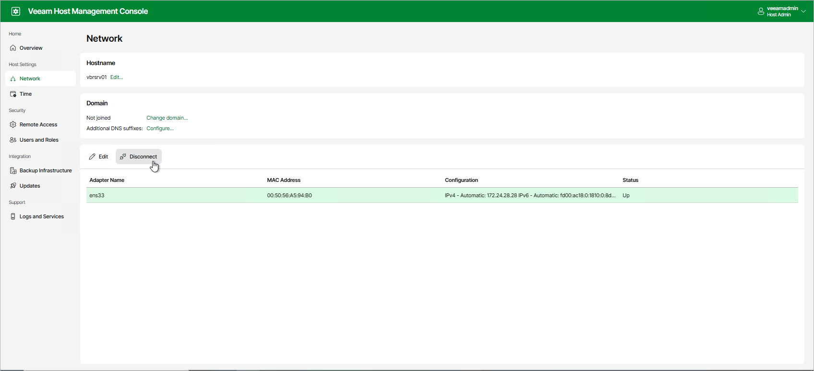
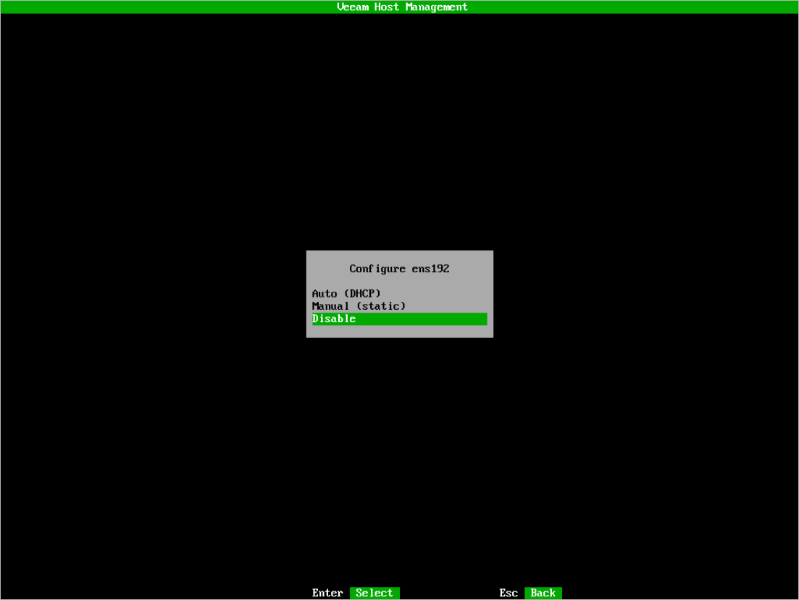
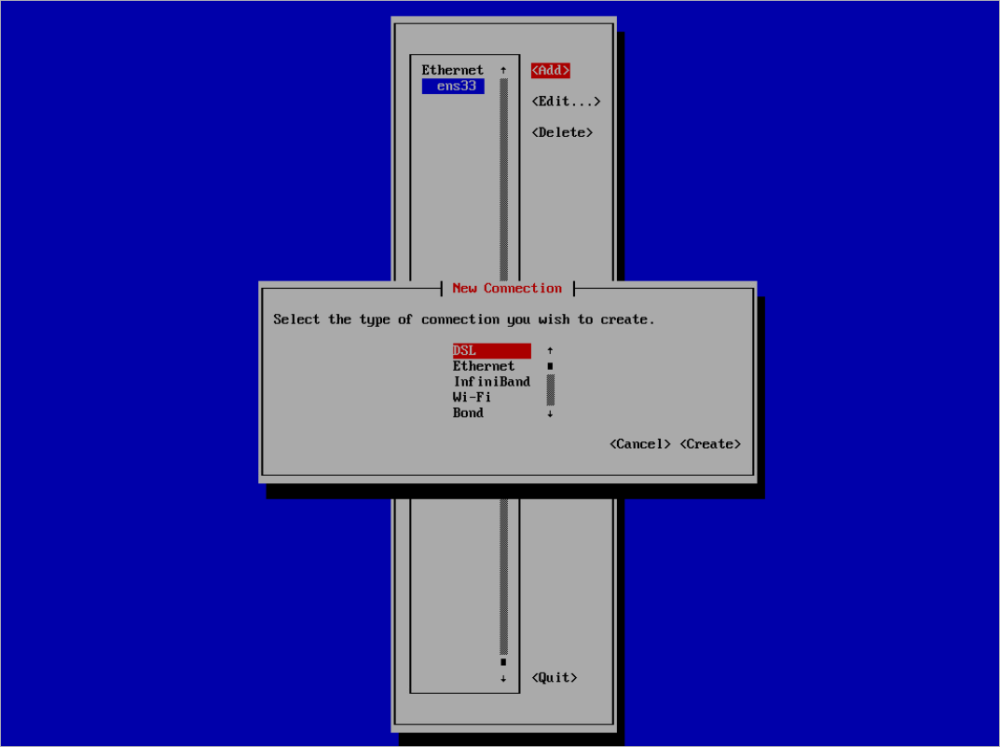

# Configuring Network Interfaces

You can perform basic and advanced operations with network interfaces:

* [Configure default network interface](#manage_configuration)
* [Manage network interfaces](#manage_adapters)
* [Configure multiple network connections](#manage_multiple_connections) — Virtual Local Area Networks (VLANs), bonds, tunnels, and other connection types

Configuring Default Network Interface

By default, Veeam appliances use one network interface that is configured automatically during the installation. You can change the default configuration in the Veeam Host Management web UI or TUI.

If you use the Veeam Host Management web UI, perform the following steps:

1. Log in to the Veeam Host Management web UI as a Host Administrator.
2. In the management pane, click Network.
3. Select the network adapter and click Edit.
4. Configure required settings and click Save.

|  |
| --- |
| Tip |
| To specify multiple DNS servers, separate them by a comma. |

If you use the Veeam Host Management TUI, perform the following steps:

1. Log in to the Veeam Host Management TUI as a Host Administrator.
2. In the main menu, select Host configuration > Network.
3. Select the network adapter and press [Enter].
4. Select the Manual option.
5. Configure required settings and press [Apply].

If you want to configure advance settings for the default network interface, do the following:

1. In the main menu, select Host configuration > Advanced network.
2. Select the network adapter and press [Edit].
3. Configure required settings and press [OK].

Managing Network Interfaces

You can do the following operations with the network interfaces:

* [Disable network interface](#disable_network)
* [Enable network interface](#enable_network)
* [Restart network services](#restart_network)

Disabling Network Interface

You can disable a network interface in the Veeam Host Management web UI and TUI.

If you use the Veeam Host Management web UI, perform the following steps:

1. Log in to the Veeam Host Management web UI as a Host Administrator.
2. In the management pane, click Network.
3. Select the network interface and click Disconnect.

|  |
| --- |
| Note |
| If you disable the only network interface, the connection to the Veeam Host Management web UI will be lost. You can enable the interface again in the Veeam Host Management TUI. |

If you use the Veeam Host Management TUI, perform the following steps:

1. Log in to the Veeam Host Management TUI as a Host Administrator.
2. In the main menu, select Host configuration > Network.
3. Select the network interface and press [Enter].
4. Select Disable and press [Enter].

Enabling Network Interface

When you enable a network interface, consider the following:

* If you use multiple network interfaces and want to enable one of them, you can do it in the Veeam Host Management web UI or TUI.
* If you disabled all network interfaces, you can enable them only in the Veeam Host Management TUI.

If you use the Veeam Host Management web UI, perform the following steps:

1. Log in to the Veeam Host Management web UI as a Host Administrator.
2. In the management pane, click Network.
3. Select the network interface and click Connect.

If you use the Veeam Host Management TUI, perform the following steps:

1. Log in to the Veeam Host Management TUI as a Host Administrator.
2. In the main menu, select Host configuration > Network.
3. Select the network interface and press [Enter].
4. Select Enable and press [Enter].

Restarting Network Services

To restart network services, perform the following steps in the Veeam Host Management TUI:

1. Log in to the Veeam Host Management TUI as a Host Administrator.
2. In the main menu, select Host configuration > Advanced network and press [F5].

Configuring Multiple Network Connections

In the Veeam Host Management TUI, you can use the nmtui tool to add multiple network connections including VLANs, bonds, tunnels, and so on. To do this, perform the following steps:

1. Log in to the Veeam Host Management TUI as a Host Administrator.
2. In the main menu, select Host configuration > Advanced network.
3. Press [Add].
4. Select the connection type and press [Create].
5. Configure specific settings for the selected connection type. For more information, see [this Red Hat article](https://docs.redhat.com/en/documentation/red_hat_enterprise_linux/9/html/configuring_and_managing_networking).
6. Press [OK].

|  |
| --- |
| Tip |
| To combine a network bond with a VLAN, create the bond first. Then, configure VLAN tagging. For more information, see these Red Hat articles:   * [Configuring a network bond by using nmtui](https://docs.redhat.com/en/documentation/red_hat_enterprise_linux/9/html/configuring_and_managing_networking/configuring-network-bonding_configuring-and-managing-networking#proc_configuring-a-network-by-bond-using-nmtui_configuring-network-bonding) * [Configuring VLAN tagging by using nmtui](https://docs.redhat.com/en/documentation/red_hat_enterprise_linux/9/html/configuring_and_managing_networking/configuring-vlan-tagging_configuring-and-managing-networking#proc_configuring-vlan-tagging-by-using-nmtui_configuring-vlan-tagging) |

