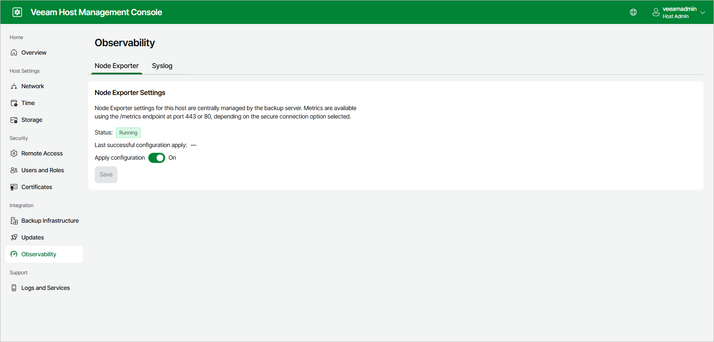
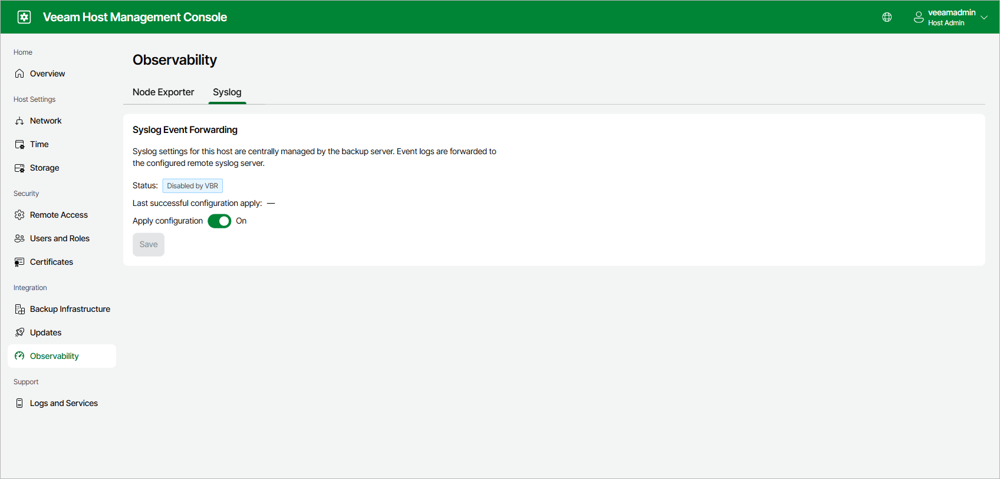

# Configuring Monitoring Settings

In the Veeam Host Management console, the Observability page shows the current status of Node Exporter and Syslog event forwarding. It also shows when the monitoring configuration was last applied.

|  |
| --- |
| Note |
| You configure Node Exporter and Syslog settings centrally in the Veeam Backup & Replication web UI. For more information, see [Configuring 3rd Party Monitoring](configure_observability.md). |

You can disable monitoring on specific appliances in your backup infrastructure:

* To disable Node Exporter metrics sharing:

1. Log in to the Host Management console of the specific appliance.
2. In the management pane, click Observability > Node Exporter.
3. Set the Apply configuration toggle to Off.
4. Click Save.

* To disable Syslog event forwarding on an appliance:

1. Log in to the Host Management console of the specific appliance.
2. In the management pane, click Observability > Syslog.
3. Set the Apply configuration toggle to Off.
4. Click Save.

Page updated 2026-07-03

