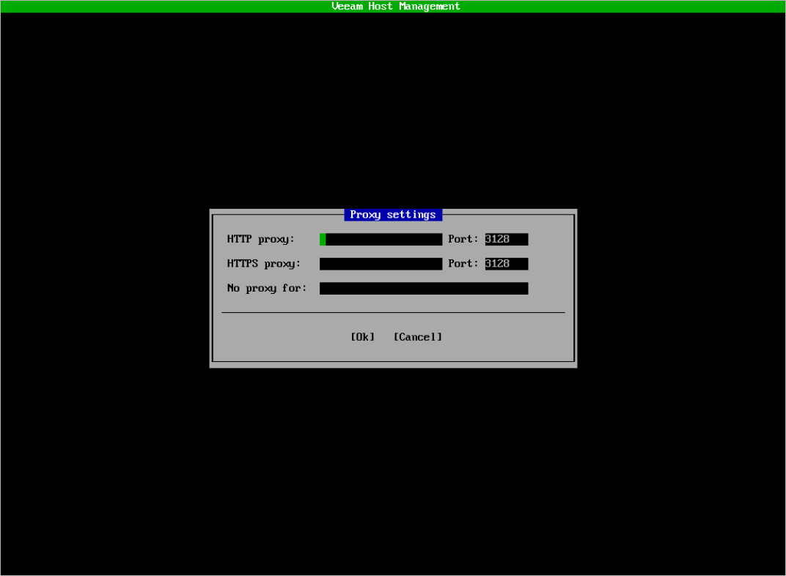

# Configuring HTTP/HTTPS Proxies

In the Veeam Host Management TUI, you can configure HTTP/HTTPS internet proxies. To do this, perform the following steps:

1. In the main menu, select Host configuration > HTTP proxy.
2. Specify required proxy settings and press [Ok].

