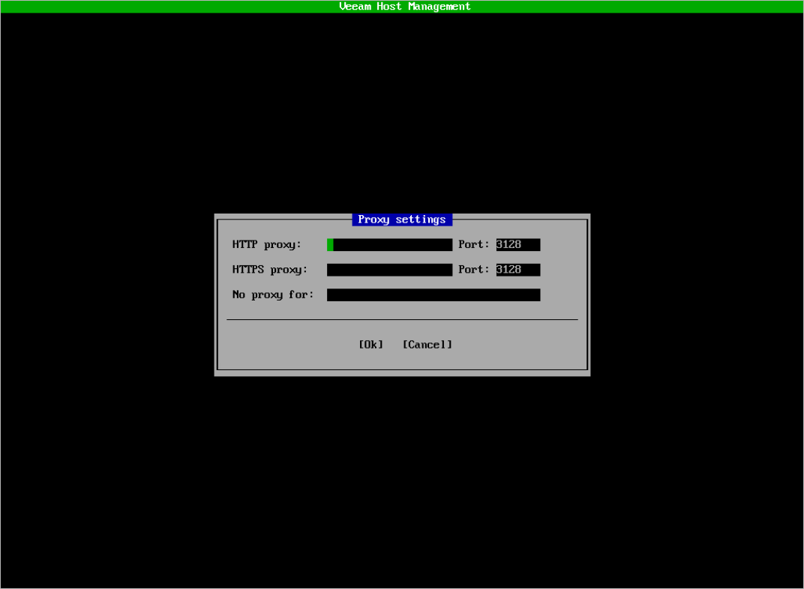

# Configuring HTTP/HTTPS Proxies

In the Veeam Host Management TUI, you can configure HTTP/HTTPS internet proxies. To do this, perform the following steps:

1. In the main menu, select Host configuration > HTTP proxy.
2. Specify required proxy settings and press [Ok].

After you configure a proxy, you can use the No proxy for field to specify destinations that the Appliance can connect to directly. You can specify the following types of destinations:

* Specific hostnames such as server1 or server1.domain.test.
* Specific IP addresses such as 172.21.241.5.
* Domain-level wildcards such as example.domain.com, exampledomain.com, or .com.

When specifying multiple addresses and hostnames, each one must be separated by a comma. For example, 172.21.241.5,.exampledomain.com,server1.

|  |
| --- |
| Tip |
| Any proxy settings configured in the Veeam Host Management TUI do not apply to Veeam Updater. You must configure it separately. For more information, see [Updating Veeam Appliances](update_appliances.md). |

