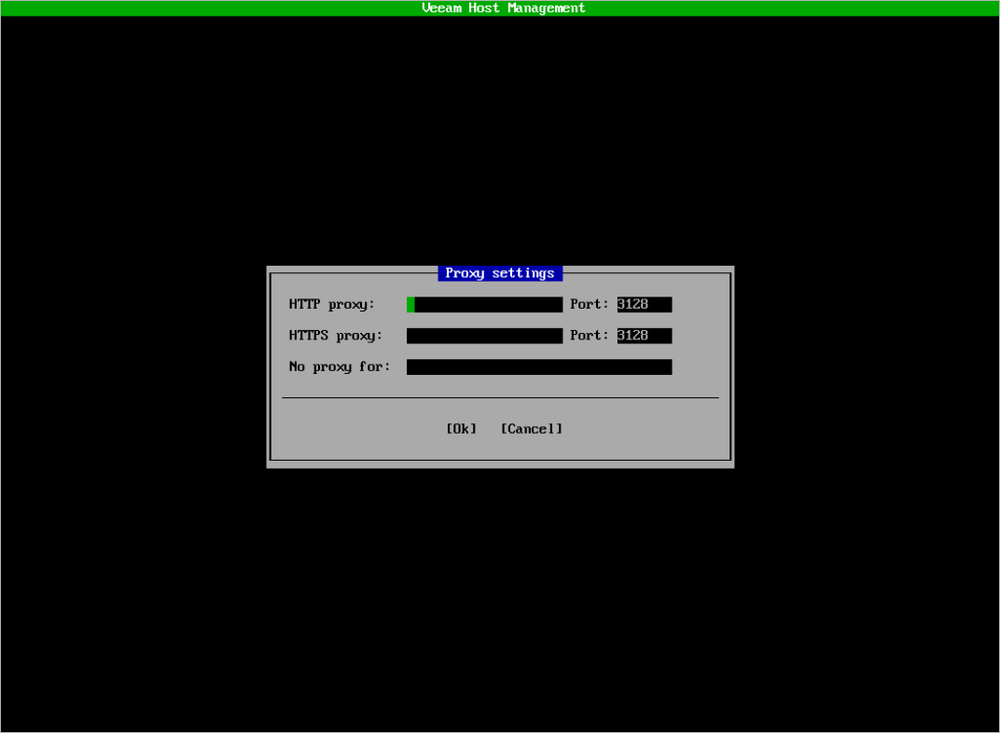

# Configuring HTTPS Proxies

In the Veeam Host Management TUI, you can configure HTTPS internet proxies. To do this, perform the following steps:

1. In the main menu, select Host configuration > HTTP proxy.
2. If you have not configured a proxy previously, select Enable proxy and press [Space].
3. Specify an HTTPS proxy and press [Enter].

After you configure a proxy, you can use the Bypass field to specify destinations that the appliance can connect to directly. You can specify the following types of destinations:

* Specific hostnames such as server1 or server1.domain.test.
* Specific IP addresses such as 172.21.241.5.

When specifying multiple addresses and hostnames, each one must be separated by a comma. For example, 172.21.241.5,server1.domain.test,server1.

|  |
| --- |
| Tip |
| Any proxy settings configured in the Veeam Host Management TUI do not apply to Veeam Updater. You must configure it separately. For more information, see [Updating Veeam Appliances](update_appliances.md). |

Page updated 2026-06-18

