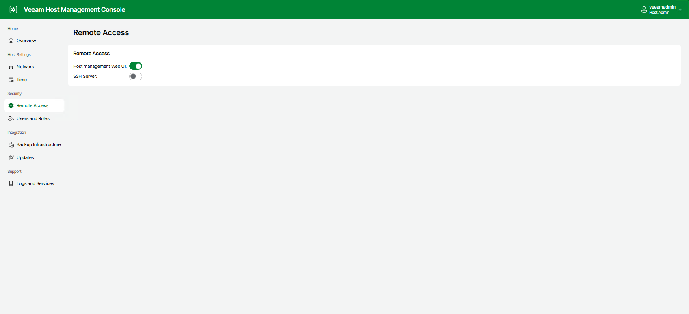
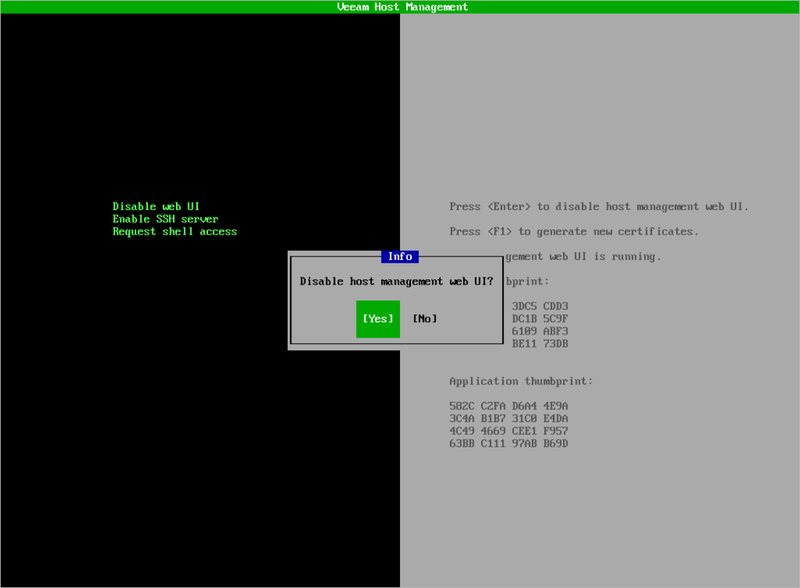
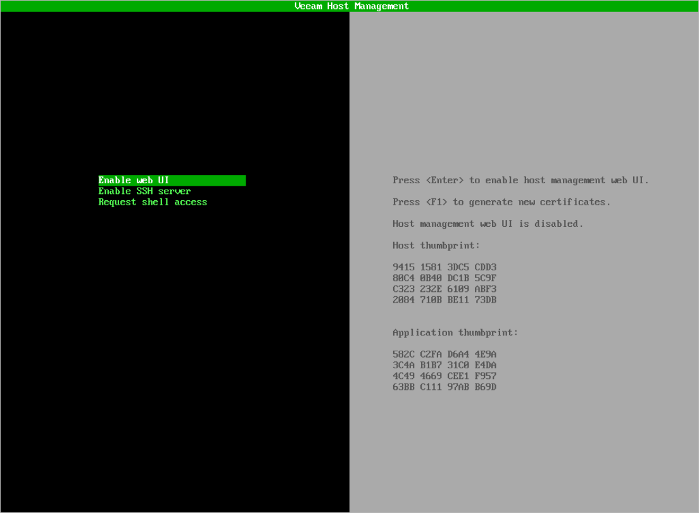
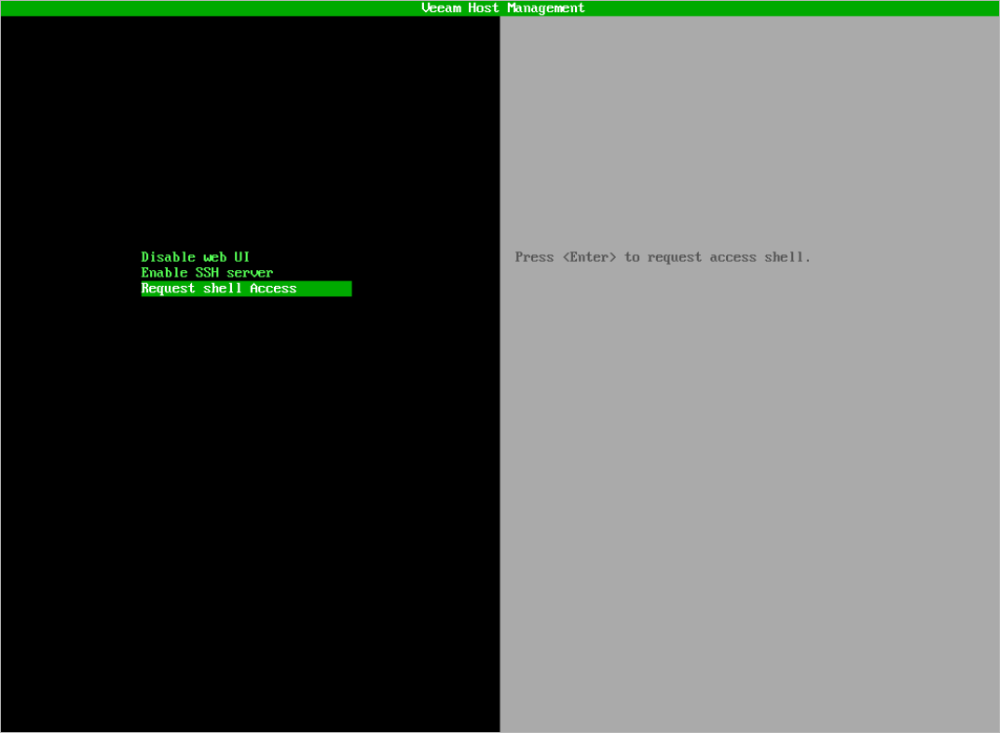

# Configuring Remote Access Settings

Users with Host Administrator permissions can perform the following operations within the remote access settings:

* [Enable and disable access to the Veeam Host Management web UI](#access_web_ui)
* [Enable and disable SSH access](#access_ssh)

Users with Security Officer permissions can approve or reject requests from Host Administrator users for temporary access to the root shell. For more information, see [Managing Root Shell Access](#access_root_shell).

Managing Access to Veeam Host Management Web UI

By default, you can configure Veeam appliances through the Veeam Host Management web UI. If you want to disable web UI access, perform the following steps:

* If you use the Veeam Host Management web UI, do the following:

1. In the management pane, click Remote Access.
2. Set the Host management Web UI toggle to Off.

|  |
| --- |
| Note |
| If you disable web UI access, all active Veeam Host Management web UI sessions will be closed. You can enable web UI access again in the Veeam Host Management TUI. |

* If you use the Veeam Host Management TUI, do the following:

1. In the main menu, select Remote access configuration.
2. Select Disable web UI, press [Enter] and confirm the operation.

|  |
| --- |
| Note |
| If you disable web UI access, all active Veeam Host Management web UI sessions will be closed. You can enable web UI access again in the Veeam Host Management TUI. |

To enable web UI access in the Veeam Host Management TUI, perform the following steps:

1. In the main menu, select Remote access configuration.
2. Select Enable web UI and press [Enter].

Managing SSH Access

By default, you cannot connect to Veeam appliances through SSH. If required, you can enable SSH access in the Veeam Host Management web UI or TUI.

If you did not configure the Security Officer account during the Veeam appliance installation, SSH access will be available immediately. If you configured the Security Officer account, SSH access will be available after the Security Officer approves the request.

If you use the Veeam Host Management web UI, perform the following steps:

1. In the management pane, click Remote Access.
2. Set the SSH Server toggle to On.

If you use the Veeam Host Management TUI, perform the following steps:

1. In the main menu, select Remote access configuration.
2. Select Enable SSH server and press [Enter].

|  |
| --- |
| Note |
| If you disable SSH access, all active SSH sessions will be closed. |

Managing Root Shell Access

For troubleshooting or other specific purposes, you can use the Veeam Host Management TUI root shell.

|  |
| --- |
| Important |
| Consider the following:   * You cannot access the TUI root shell through SSH. Only local connection through a physical console or a virtual remote console is supported. * The Host Administrator does not get root privileges. The TUI shell runs under the root account. * Use the TUI root shell carefully when you run any commands or change configuration files. Custom configurations are not supported by Veeam. |

If you did not configure the Security Officer account during the Veeam appliance installation, users with Host Administrator permissions have permanent access to the TUI root shell. To run the TUI root shell, perform the following steps:

1. Log in to the Veeam Host Management TUI.
2. In the main menu, select Remote access configuration.
3. Select Enter shell and press [Enter].

If you configured the Security Officer account during the Veeam appliance installation, users with Host Administrator permissions must request temporary access to the TUI root shell. To do this, perform the following steps:

* If you use the Veeam Host Management web UI, do the following:

1. Log in to the Veeam Host Management web UI.

1. In the management pane, click Overview.

1. In the Quick Actions section, click Request root access.

* If you use the Veeam Host Management TUI, do the following:

1. Log in to the Veeam Host Management TUI.

1. In the main menu, select Remote access configuration.

1. Select Request shell access, press [Enter] and confirm the operation.

If the Security Officer approves the request, access to the TUI root shell will be granted for 8 hours from the first login. The access is not revoked after activity timeouts.

