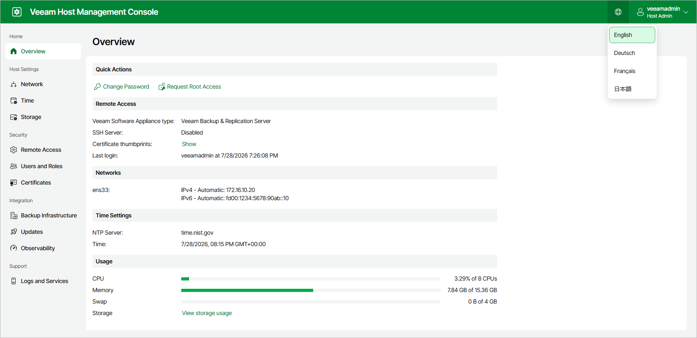

# Configuring Veeam Host Management Localization Settings

Users can perform the following operations to change the localization settings in the Veeam Host Management console:

* [Change Language Settings in the Web UI](hmc_configure_settings.md#Language)
* [Change Keyboard Layout in the TUI](hmc_configure_settings.md#Keyboard)

Changing Language Settings in Web UI

In the Veeam Host Management console web UI, you can select the interface language. The following languages are supported: English, German, French, and Japanese.

To change the language, click the globe icon in the top bar and select the language you want to use.

|  |
| --- |
| Note |
| The language is saved for each account individually. |

Changing Keyboard Layout in TUI

In the Veeam Host Management TUI, you can change the keyboard layout. By default, the TUI uses the US English keyboard layout.

To change the keyboard layout, do the following:

1. On the login screen or main menu of the Veeam Host Management TUI, press [Ctrl+K].
2. Select the layout you want to use. Layout codes are listed alphabetically.
3. Press [Enter].

|  |
| --- |
| Note |
| The selected keyboard layout applies to the TUI only. |

Page updated 2026-07-15

