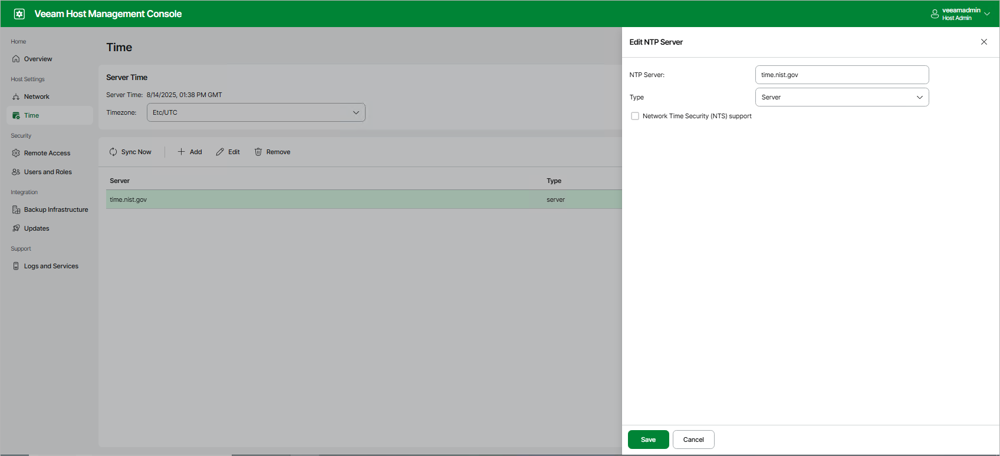
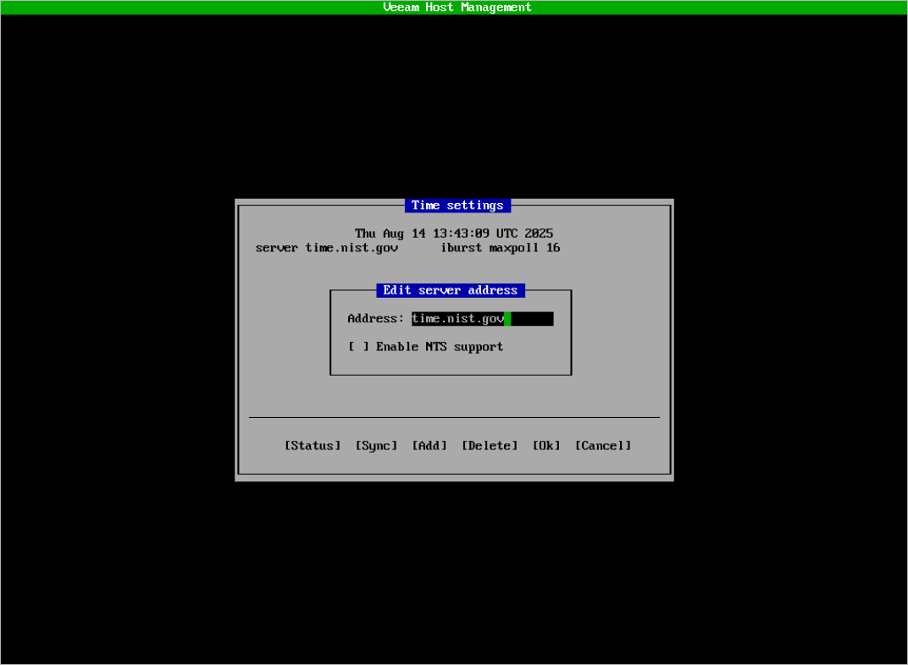
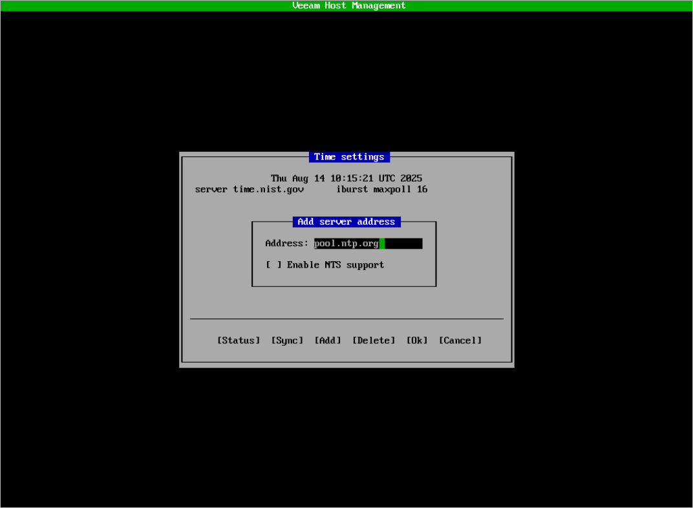

# Configuring Server Time Settings

Users with Host Administrator permissions can perform the following operations within the server time settings:

* [Change the timezone](#change_timezone)
* [Change the default time server](#change_default_time_server)
* [Adding time servers](#add_time_servers)
* [Delete time servers](#delete_time_servers)

Users with Security Officer permissions cannot configure server time settings.

Changing Timezone

In the Veeam Host Management web UI, you can change the timezone of the server where the backup infrastructure component is installed. To do this, perform the following steps:

1. In the management pane, click Time.
2. In the Server Time section, select the required timezone and click Update.

Changing Default Time Server

By default, Veeam appliances use one NTP server time.nist.gov that is configured automatically during the installation. You can change the default time server in the Veeam Host Management web UI or TUI.

If you use the Veeam Host Management web UI, perform the following steps:

1. In the management pane, click Time.
2. To change the default time server, select the name of the server and click Edit.
3. Specify the name and the type of the time server. Enable the NTS support if required.
4. Click Save.
5. To synchronize server system time with the new time server, click Sync Now.

If you use the Veeam Host Management TUI, perform the following steps:

1. In the main menu, select Host configuration > Time.
2. Select the name of the server and press [Enter].
3. Configure required settings:

* In the Address field, specify the name of the time server.
* Enable the NTS support if required.

1. Press [Ok].
2. To check the status of the time server, press [Status].

Adding Time Servers

You can add several time servers in the Veeam Host Management web UI or TUI.

|  |
| --- |
| Note |
| Veeam appliances support NTP and public NTS time servers. It is recommended to use a minimum of 3 to mitigate timing issues. |

If you use the Veeam Host Management web UI, perform the following steps:

1. In the management pane, click Time.
2. Click Add.
3. Specify the time server settings:

* In the NTP Server field, specify the name of the time server.
* From the Type drop-down list, select the type of the time server:

* Server — A single time server.
* Pool — A pool of public time servers.

* Enable the NTS support if required.

1. Click Save.
2. To synchronize server system time with time servers, click Sync Now.

If you use the Veeam Host Management TUI, perform the following steps:

1. In the main menu, select Host configuration > Time.
2. Press [Add].
3. Specify the time server settings:

* In the Address field, specify the name of the time server.
* Enable the NTS support if required.

1. Press [Ok].
2. To synchronize server system time with time servers, press [Sync].

Deleting Time Servers

You can delete time servers in the Veeam Host Management web UI or TUI.

If you use the Veeam Host Management web UI, perform the following steps:

1. In the management pane, click Time.
2. Select the time server and click Remove.

If you use the Veeam Host Management TUI, perform the following steps:

1. In the main menu, select Host configuration > Time.
2. Select the time server and press [Delete].

