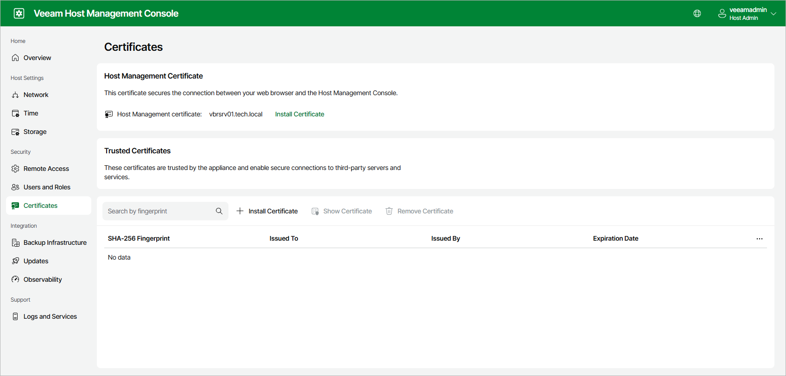

# Managing Certificates

Users with Host Administrator permissions can manage the following certificates in the Veeam Host Management web UI:

* Host management certificate — secures the connection between the web browser and the Veeam Host Management Console.
* Trusted certificates — allow the appliance to trust third-party servers and services, such as a syslog server that uses a custom TLS certificate.

|  |
| --- |
| Important |
| Changing the host management certificate or adding a trusted certificate requires Security Officer approval. For more information, see [Performing Security Officer Tasks](hmc_perform_so_tasks.md). |

|  |
| --- |
| Note |
| Before you add a new certificate, consider the following:   * The file name of the certificate must be less than 255 characters. * The file name must contain only ASCII symbols. |

Host Management Certificate

By default, the appliance uses a self-signed certificate. You can replace it with your own certificate or generate a new self-signed certificate to rotate the current one.

To install your own certificate, do the following:

1. Log in to the Veeam Host Management web UI as a Host Administrator. For more information, see [Accessing Veeam Host Management Console](hmc_access.md).
2. In the management pane, click Certificates.
3. In the Host Management Certificate section, click Install Certificate.
4. At the Certificate Source step, select Upload a new certificate and click Next.

1. At the Choose Certificate step, select the certificate file in the .crt, .cer, .pem, or .der format. If the private key is in a separate file, also select the .pem key file and, if it is protected, enter its password. Click Next.

1. At the Summary step, review the certificate details and click Finish.

To generate a new self-signed certificate, do the following:

1. Log in to the Veeam Host Management web UI as a Host Administrator. For more information, see [Accessing Veeam Host Management Console](hmc_access.md).
2. In the management pane, click Certificates.
3. In the Host Management Certificate section, click Install Certificate.
4. At the Certificate Source step, select Generate a self-signed certificate and click Next.

1. At the Generate Certificate step, enter a friendly name for the certificate and click Next.

1. At the Summary step, review the certificate details and click Finish.

After the certificate is updated, the web interface restarts automatically.

|  |
| --- |
| Important |
| A custom certificate is not regenerated if the host name changes or the appliance joins a domain. Make sure the certificate contains the correct fully qualified domain name (FQDN) of the appliance. |

Trusted Certificates

If the appliance must connect to a third-party server or service that uses a certificate it does not already trust, add that certificate to the trusted store. To do this, do the following:

1. Log in to the Veeam Host Management web UI as a Host Administrator. For more information, see [Accessing Veeam Host Management Console](hmc_access.md).
2. In the management pane, click Certificates.
3. In the Trusted Certificates section, click Install Certificate.
4. At the Choose Certificate step, select the certificate file in the .crt, .cer, .pem, or .der format. Click Next.

1. At the Summary step, review the certificate details and click Finish.

To view or remove a trusted certificate, select it in the list and click Show Certificate or Remove Certificate.

To find a certificate, enter its fingerprint in the search box.

Page updated 2026-07-16

