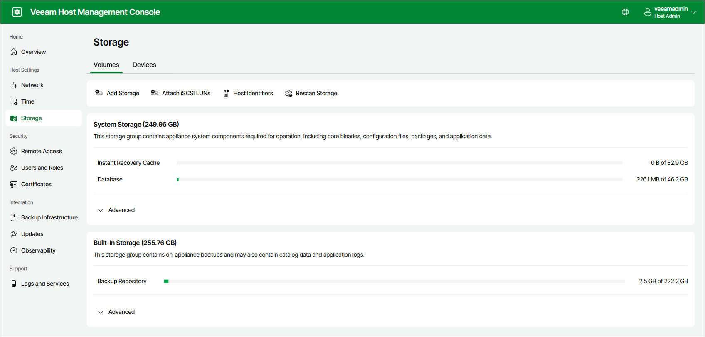
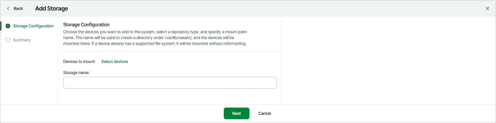
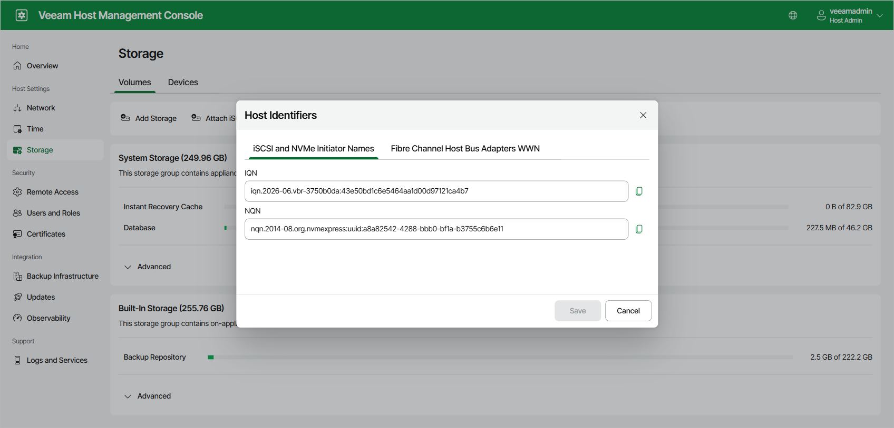

# Managing Storage

On the Storage page of the Veeam Host Management web UI, you can review storage usage on the appliance and attach additional storage devices. Users with Host Administrator permissions can perform the following operations with storage:

* [View storage usage](#storage_usage)
* [Add local, iSCSI and Fibre Channel storage](#add_storage)
* [Attach iSCSI LUNs](#iscsi)
* [View the host identifiers required for network storage](#host_identifiers)
* [View details, rescan and forget attached devices](#manage_devices)

|  |
| --- |
| Note |
| Before you can attach network storage devices (iSCSI and Fibre Channel), you must enable Network Storage Management. For more information, see [Configuring Backup Infrastructure Settings](hmc_configure_infrastructure.md). |

Viewing Storage Usage

The Volumes tab of the Storage page shows the file system load of the appliance storage, grouped into the following storage groups:

* System Storage — appliance system components required for operation, including core binaries, configuration files, packages and application data.
* Built-In Storage — on-appliance backups. This group may also contain catalog data and application logs.
* Additional Storage — Linux-based backup repositories added after installation. This group appears only after you add storage.

Each storage group shows the used and total space for its logical volumes. To see a detailed breakdown of a group, click Advanced.

To view storage usage, perform the following steps:

1. Log in to the Veeam Host Management web UI as a Host Administrator.
2. In the management pane, click Storage.
3. Open the Volumes tab.

You can also review basic resource consumption of the appliance in the Usage section of the Overview page. To open the Storage page from there, click View storage usage.

Adding Storage

You can add local, iSCSI and Fibre Channel devices to the appliance and mount them for use as backup repositories. When you add storage, consider the following:

* If a device already has a supported file system (XFS or ZFS), it is mounted without reformatting. Blank devices are formatted before they are mounted.
* If you are configuring storage on a Veeam Infrastructure Appliance with the Hardened Repository role, you must also select a Repository type — Linux / Hardened for a hardened, immutable repository, or Application Backup for an Application Backup repository. Application Backup appears only after you enable it on the Backup Infrastructure page. For more information, see [Configuring Backup Infrastructure Settings](hmc_configure_infrastructure.md).

To add storage, perform the following steps:

1. Log in to the Veeam Host Management web UI as a Host Administrator.
2. In the management pane, click Storage.
3. Click Add Storage.
4. In the Add Storage window, click Select devices, select the devices you want to mount and click Select.
5. In the Storage name field, enter a name for the storage.
6. If you are configuring storage on a Veeam Infrastructure Appliance with the Hardened Repository role, in the Repository type field, select the required repository type.
7. Click Next.
8. At the Summary step of the wizard, review the settings and click Finish.

|  |
| --- |
| Note |
| Added devices are not registered as backup repositories in Veeam Backup & Replication automatically. To use the storage for backups, add it as a backup repository in the Veeam Backup & Replication console. For more information, see [Backup Repositories](backup_repository.md). |

Attaching iSCSI LUNs

To connect iSCSI storage, attach the iSCSI LUNs presented by your storage system. After the LUNs are attached, you can add them as storage as described in [Adding Storage](hmc_manage_storage.md#add_storage).

To attach iSCSI LUNs, perform the following steps:

1. Log in to the Veeam Host Management web UI as a Host Administrator.
2. In the management pane, click Storage.
3. Click Attach iSCSI LUNs.
4. At the iSCSI Portal Settings step of the wizard, in the Portal address field, enter the address of the iSCSI portal. If required, specify the Port.
5. If the portal requires CHAP authentication, set the Requires authentication toggle to On and enter the Username and Password.
6. Click Next.
7. At the Select iSCSI Targets step of the wizard, select the targets you want to attach and click Next. Multipathing is applied automatically where possible.
8. At the Summary step of the wizard, review the settings and click Finish.

|  |
| --- |
| Note |
| Consider the following:   * Mounting the same iSCSI device on multiple hosts is not supported. * When a device is detached, all drives connected to the same target are detached as well. * CHAP authentication works only if the storage system uses SHA-256 or SHA3-256 for CHAP. |

Viewing Host Identifiers

To present network storage to the appliance, your storage system needs the host identifiers of the appliance. The Host Identifiers window shows the following identifiers:

* The IQN and NQN initiator names, on the iSCSI and NVMe Initiator Names tab.
* The Fibre Channel host bus adapter WWNs, on the Fibre Channel Host Bus Adapters WWN tab.

To view the host identifiers, perform the following steps:

1. Log in to the Veeam Host Management web UI as a Host Administrator.
2. In the management pane, click Storage.
3. Click Host Identifiers. To copy an identifier, click the copy icon next to it.

|  |
| --- |
| Note |
| Changing the host FQDN does not change the host identifiers. You can change the IQN as required, provided that it uses a valid format. |

Managing Attached Devices

The Devices tab of the Storage page lists all attached devices and their details. On this tab, you can perform the following operations:

* To view detailed information about a device, select it and click View Details.
* To discover newly presented devices, click Rescan Storage.
* To unmount a device, select it and click Unmount.
* To detach an iSCSI LUN, select it and click Detach iSCSI LUNs.
* To detach a device from the appliance, select it and click Forget Device.

Page updated 2026-07-30

