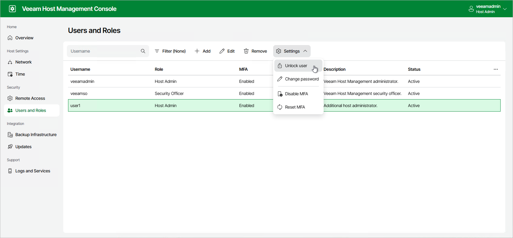
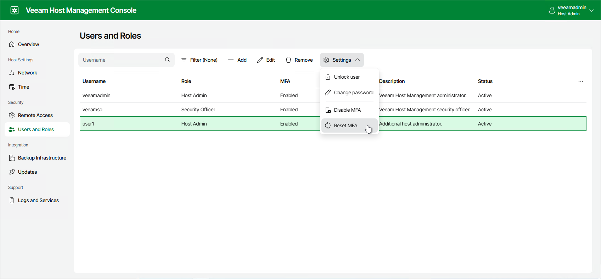
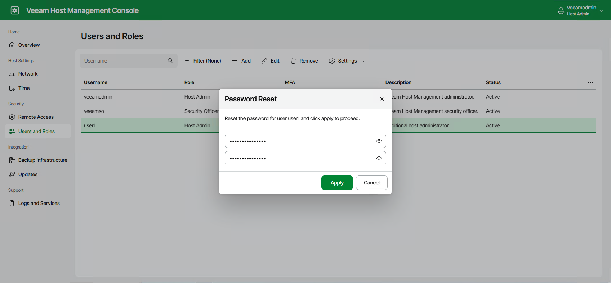
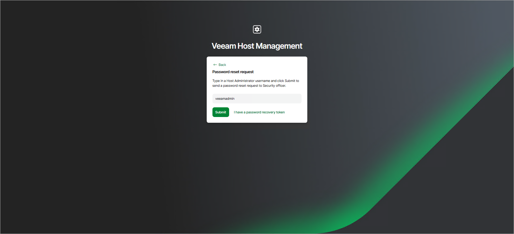

# Managing User Authentication

Users with Host Administrator permissions can perform the following operations related to authentication of the local Veeam appliance users:

* Configure password policies
* Change own password
* Unlock users
* Reset multi-factor authentication
* Reset user passwords

|  |
| --- |
| Note |
| The multi-factor authentication code configured for a Host Administrator account also governs sign-in to the Veeam Backup & Replication console and web UI. If you upgrade a Linux-based backup server to version 13.1 (build 13.1.0.411), the previously separate Veeam Host Management and Veeam Backup & Replication MFA codes are merged into one. After the upgrade, use the MFA code configured in Veeam Host Management console. For more information, see [Multi-Factor Authentication](mfa.md) in the Veeam Backup & Replication User Guide. |

Users with Security Officer permissions can only approve authorization requests to reset user passwords. For more information, see [Performing Security Officer Tasks](hmc_perform_so_tasks.md).

|  |
| --- |
| Note |
| If you have multi-factor authentication enabled, you must enter a one-time password before you can perform the following operations on Host Administrator accounts:   * Change a user password * Reset multi-factor authentication * Unlock users   Authentication remains valid for 15 minutes. |

Configuring Password Policies

A Host Administrator can define password policies that apply to all local users, except users with the Service Account role.

|  |
| --- |
| Note |
| Password policy settings are preserved during upgrades. |

To configure password policies, perform the following steps:

1. Log in to the Veeam Host Management web UI as a Host Administrator.
2. In the management pane, click Users and Roles.
3. Click Password Policies.
4. Configure Allow remote password reset. When enabled, users can request a password reset remotely from the sign-in page. A new, temporary password for the account must be set by a Security Officer.
5. Configure Require password change every N days. When enabled, this specifies the number of days a password remains valid. The default is 60 days. You can specify a value from 1 to 365 days. To disable password expiration, clear the check box.

|  |
| --- |
| Note |
| Disabling password expiration or setting the interval to more than 60 days violates the DISA STIG requirement V-258041. |

1. Click OK.

Unlocking Users

Users are locked after three failed login attempts. Consider the following:

* If you did not configure the Security Officer account during the Veeam appliance installation, the user will be automatically unlocked in 15 minutes. Alternatively, you can unlock the user manually.
* If you configure the Security Officer account, the user will not be automatically unlocked. You can unlock the user only manually.

To unlock the user manually, perform the following steps:

1. Log in to the Veeam Host Management web UI as a Host Administrator.
2. In the management pane, click Users and Roles.
3. Select the user.
4. Click Settings > Unlock user.

You can also unlock the user by resetting the password. For more information, see [Resetting Passwords](#reset_pass).

Resetting Multi-Factor Authentication

To reset multi-factor authentication for Host Administrator accounts, perform the following steps:

1. Log in to the Veeam Host Management web UI as a Host Administrator.
2. In the management pane, click Users and Roles.
3. Select the user.
4. Click Settings > Reset MFA.

Alternatively, you can reset multi-factor authentication through the password reset operation. For more information, see [Resetting Passwords](#reset_pass).

|  |
| --- |
| Note |
| A Host Administrator cannot reset multi-factor authentication for Security Officers. To do this, a Security Officer must use a recovery token. For more information, see [Using Recovery Token](hmc_perform_so_tasks.md#use_recovery_token). |

Resetting Passwords

A Host Administrator can reset passwords for users including other Host Administrators to solve the following authentication issues:

* A user account is locked after three failed login attempts
* A user lost or forgot their password
* A user lost or change a mobile device with the mobile authentication application and does not have a code for multi-factor authentication

|  |
| --- |
| Note |
| A Host Administrator cannot reset passwords for Security Officers. To do this, a Security Officer must use a recovery token. For more information, see [Using Recovery Token](hmc_perform_so_tasks.md#use_recovery_token). |

To reset a user account password, perform the following steps:

1. Log in to the Veeam Host Management web UI as a Host Administrator.
2. In the management pane, click Users and Roles.
3. Select the user.
4. Click Settings > Change password.
5. Specify a new password and click Apply. After password reset, the user will also need to set up multi-factor authentication.

If you are the only Host Administrator and you have authentication issues, you can reset your password in one of the following ways:

* If you did not configure the Security Officer account during the Veeam appliance installation, you can only use Veeam LiveOS to restore access to the Veeam Host Management console. For more information, see [this KB article](https://www.veeam.com/kb4761).
* If you configured the Security Officer account, you can reset the Host Administrator password through the authorization request. To do this, perform one of the following operations:

* On the Veeam Host Management web UI sign-in page, click Forgot password?, specify your user name and click Submit.
* On the Veeam Host Management TUI logon screen, specify your user name and press [F2].

After the Security Officer approves the request, the next time you log in you will also need to set up multi-factor authentication.

Page updated 2026-07-30

