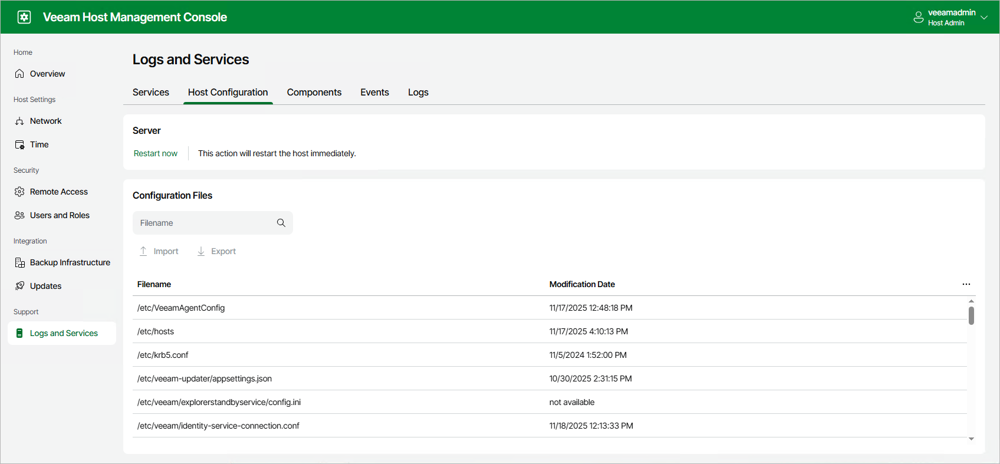
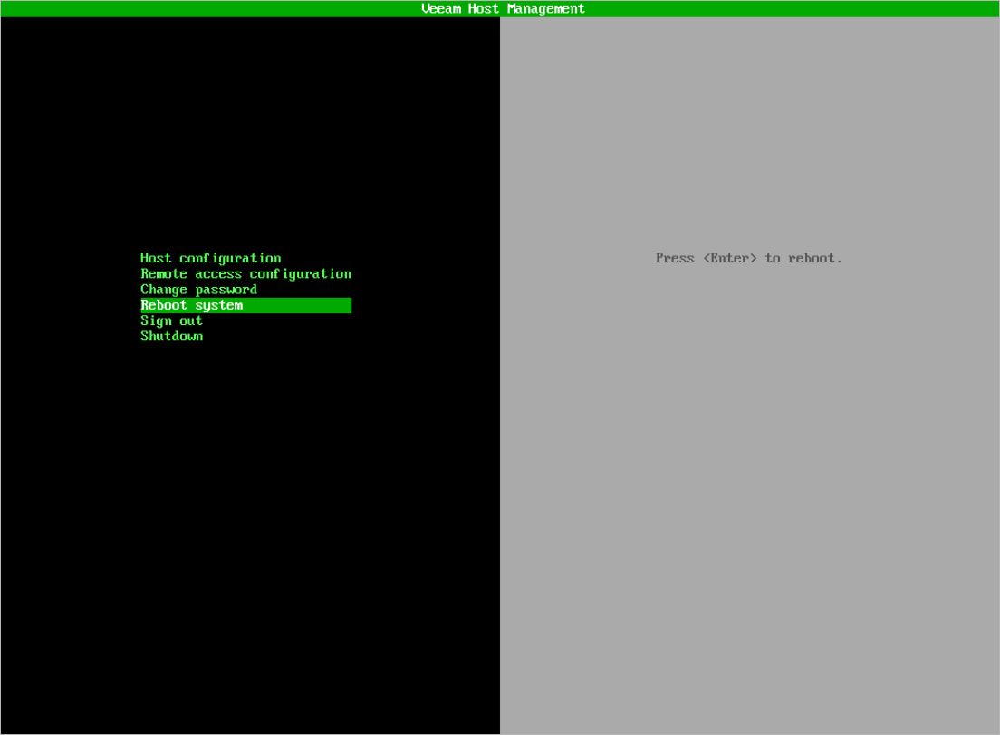
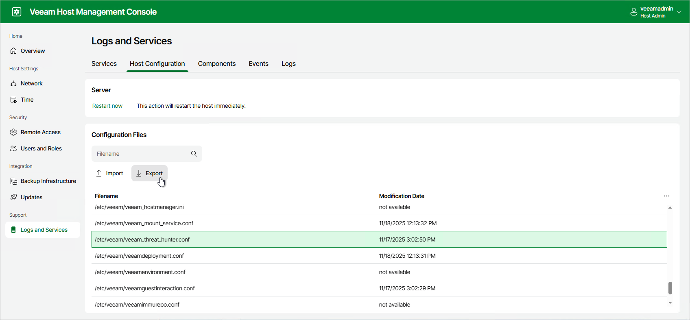
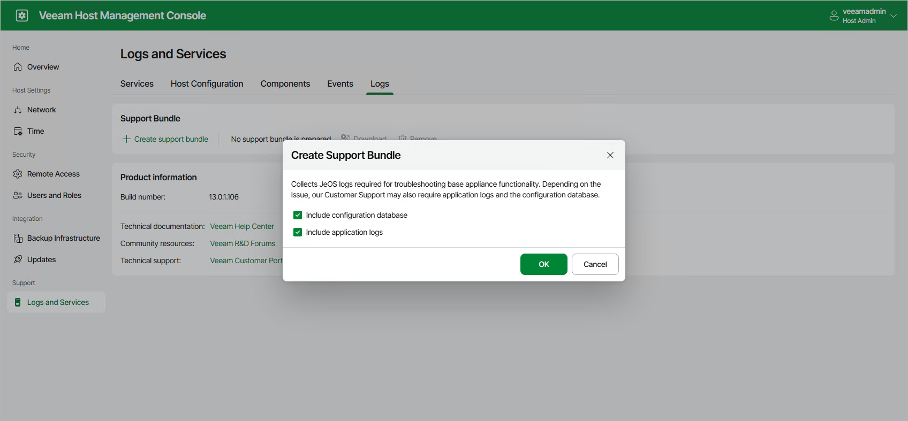
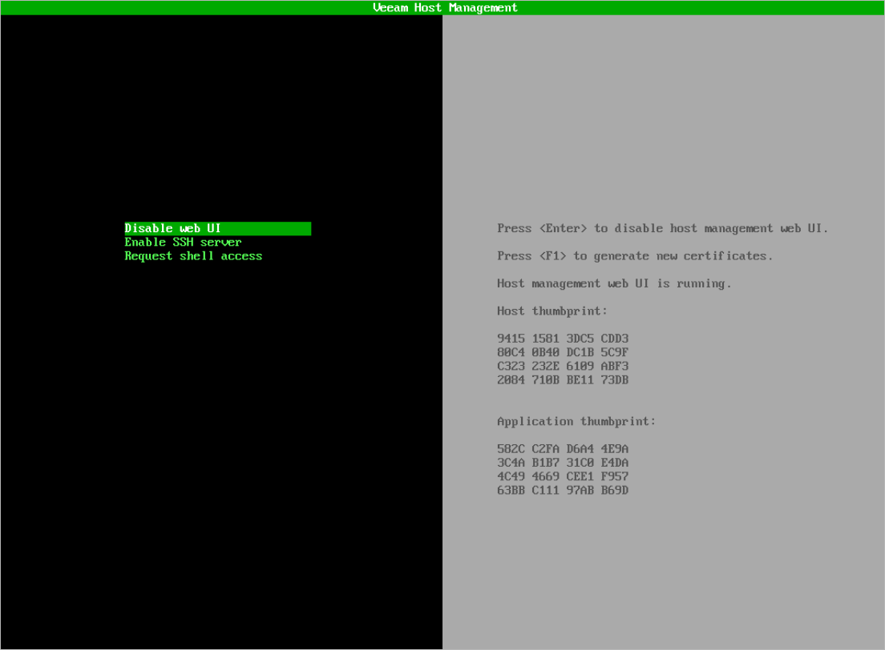

# Performing Maintenance Tasks

Users with Host Administrator permissions can perform the following maintenance tasks:

* Start, stop and restart Veeam services
* Restart Veeam appliance
* Import and export configuration files
* Managing Veeam components
* View and export Veeam appliance events
* Download logs
* Generate new certificate for the Veeam Host Management web UI

Managing Veeam Services

You can monitor and manage Veeam services in the Veeam Host Management web UI. To view the list of the Veeam services, log in to the Veeam Host Management web UI as a Host Administrator and click Logs and Services in the management pane. Then, click on the Services tab.

For more information, see [Veeam Backup & Replication Services](services_and_components.md).

Restarting Appliance

You can restart Veeam appliance in the Veeam Host Management web UI or TUI.

If you use the Veeam Host Management web UI, perform the following steps:

1. Log in to the Veeam Host Management web UI as a Host Administrator. For more information, see [Accessing Veeam Host Management Console](hmc_access.md).
2. In the management pane, click Logs and Services.
3. On the Host Configuration tab, click Restart now.

If you use the Veeam Host Management TUI, in the main menu, select Reboot system and press [Enter].

Managing Configuration Files

You can export and import required configuration files to customize Veeam appliance configuration. To do this, perform the following steps:

1. Log in to the Veeam Host Management web UI as a Host Administrator. For more information, see [Accessing Veeam Host Management Console](hmc_access.md).
2. In the management pane, click Logs and Services.
3. On the Host Configuration tab, select the file in the Configuration Files section and click Export.
4. After you edit the file and update configuration parameters, click Import to upload the updated file. To apply new configuration, you may need to restart the service or the server.

Managing Veeam Components

You can manage components installed on the Veeam appliance. To view the list of components, log in to the Veeam Host Management web UI as a Host Administrator and click Logs and Services in the management pane. Then, click on the Components tab.

Components and their versions are updated automatically when you add backup infrastructure components through the Veeam Backup & Replication console or install updates and hotfixes. You can also add a component manually. To do this, click Add component, select an installation package and click Upload.

To export all components in the CSV format, click Export.

Viewing Appliance Events

You can monitor system, security, configuration and other types of events occurred on the Veeam appliance. To view the list of events, log in to the Veeam Host Management web UI as a Host Administrator and click Logs and Services in the management pane. Then, click on the Events tab.

To export all events in the CSV format, click Export.

Downloading Logs

For troubleshooting, you can download all Veeam logs as an archive file. To do this, perform the following steps:

1. Log in to the Veeam Host Management web UI as a Host Administrator. For more information, see [Accessing Veeam Host Management Console](hmc_access.md).
2. In the management pane, click Logs and Services.
3. On the Logs tab, click Create support logs bundle.
4. To include operating system and Veeam logs to the archive, make sure that the Include application logs check box is selected. You can also select the Include configuration database check box to add a configuration database file to the archive.
5. Click OK.
6. When the archive is prepared, click Download.
7. After you download the archive, you can delete it from the server. To do this, click Remove.

|  |
| --- |
| Tip |
| For more information on how to attach logs to a Veeam support case, see [this KB article](https://www.veeam.com/kb4162). |

Generating Certificates

In the Veeam Host Management TUI, you can generate new certificate for the Veeam Host Management web UI. To do this, perform the following steps:

1. Log in to the Veeam Host Management TUI as a Host Administrator. For more information, see [Accessing Veeam Host Management Console](hmc_access.md).
2. In the main menu, select Remote access configuration.
3. Press [F1] to generate new certificate. The web service will be restarted.

