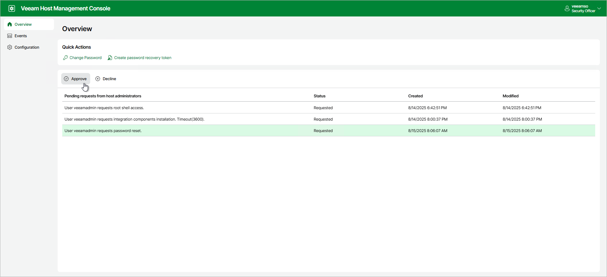
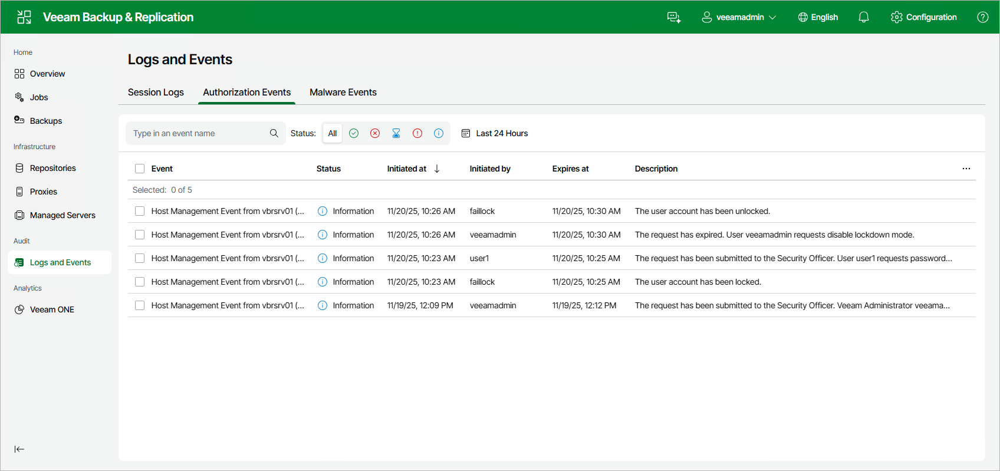
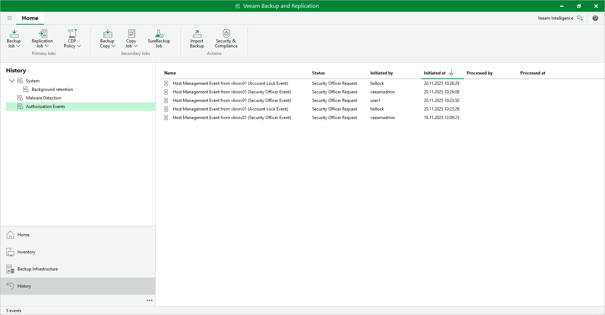
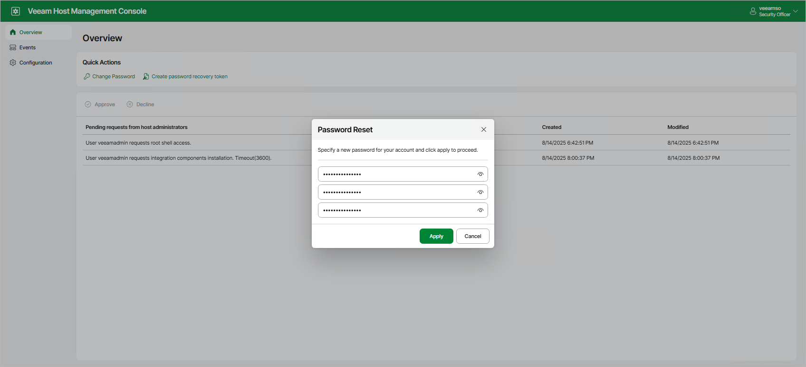
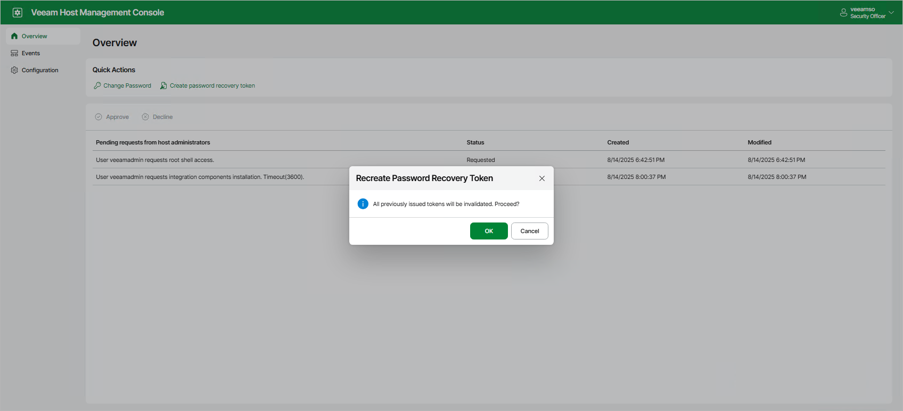
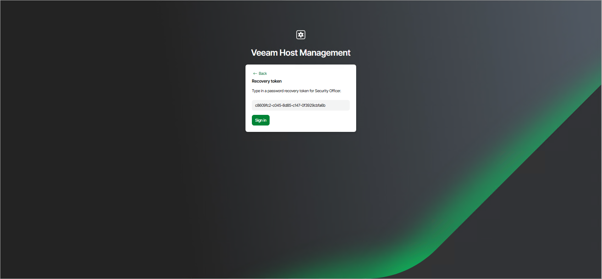
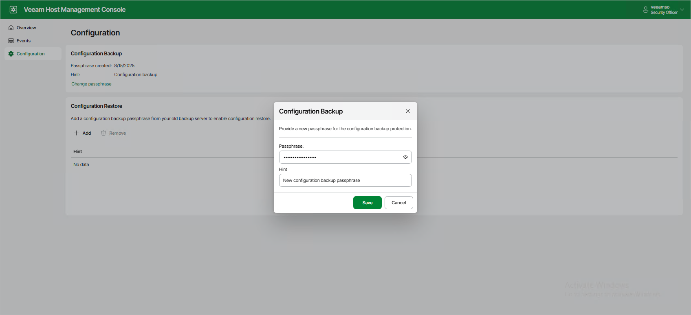
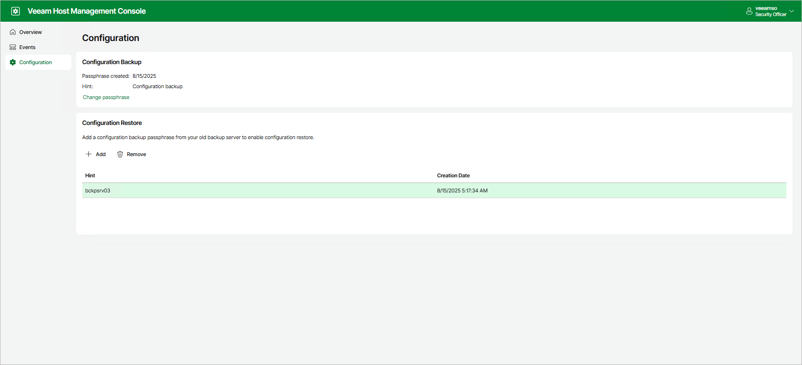

# Performing Security Officer Tasks

Users with Security Officer permissions can perform the following tasks in the Veeam Host Management web UI:

* Approve or decline authorization requests
* View authorization request events
* Reset own password
* Reset MFA
* Reset password recovery token
* Use password recovery token to resolve authentication issues
* View and export Veeam appliance events
* Manage configuration backup passphrases

Managing Authorization Requests

You can approve or decline the following requests from Host Administrators:

* Enable SSH
* Stop a Veeam service
* Grant temporary root access
* Reset password for the locked user
* Import configuration files
* Change a domain membership
* Add a Security Officer account
* Allow remote connections for Veeam Agents
* Allow a backup server to be added to a High Availability cluster
* Disable backup infrastructure lockdown

To manage authorization requests, perform the following steps:

1. Log in to the Veeam Host Management web UI as a Security Officer
2. In the management pane, click Overview.
3. Select the request and click Approve or Decline.

Viewing Authorization Request Events

Events related to Security Officer authorization requests include information about:

* Approved and rejected requests
* Locked and unlocked Host Administrator accounts

As a Security Officer, you can view these events in the Veeam Host Management web UI. For more information, see [Viewing Appliance Events](#view_appliance_events).

Local Veeam appliance users that have access to the Veeam Backup & Replication console as Backup Administrators, can view these events in the Veeam Backup & Replication web UI and desktop application.

To view authorization request events in the Veeam Backup & Replication web UI, perform the following steps:

1. Log in to the Veeam Backup & Replication web UI as a Backup Administrator.
2. In the management pane, click Logs and Events. Then, click the Authorization Events tab.

To view authorization request events in the Veeam Backup & Replication desktop application, perform the following steps:

1. Log in to the Veeam Backup & Replication console as a Backup Administrator.
2. Open the History view and select the Authorization Events node.

To view detailed information related to a specific authorization request event, select the event and click Details on the ribbon. Alternatively, right-click the event and select Details.

To receive email notifications with authorization request events, enable this setting in the Veeam Backup & Replication console. For more information, see [Configuring Global Email Notification Settings](general_email_notifications.md).

Resetting Own Password

As a Security Officer, you can reset your password in the Veeam Host Management web UI. To do this, perform the following steps:

1. Log in to the Veeam Host Management web UI as a Security Officer.
2. In the management pane, click Overview.
3. Click Change password.
4. Specify the current password and a new password and click Apply.

|  |
| --- |
| Note |
| If you forgot or lost the password, or your Security Officer account locked after three failed login attempts, you can use a recovery token to restore access to your account. For more information, see [Using Recovery Token](#use_recovery_token). |

Resetting MFA

If you have multi-factor authentication issues, lose or change a mobile device with the mobile authentication application, you can use a recovery token to restore access to your account. For more information, see [Using Recovery Token](#use_recovery_token).

Resetting Password Recovery Token

You can reset your current password recovery token. To do this, perform the following steps:

1. Log in to the Veeam Host Management web UI as a Security Officer.
2. In the management pane, click Overview.
3. Click Create password recovery token and confirm the operation.
4. Enter a 6-digit confirmation code generated in the mobile authenticator application.
5. Copy new recovery token and save it in a secure place.

|  |
| --- |
| Note |
| A new recovery token is also generated when you use your current recovery token to solve authentication issues. For more information, see [Using Recovery Token](#use_recovery_token). |

Using Recovery Token

If you forgot or lost the password, your Security Officer account locked after three failed login attempts, or you have multi-factor authentication issues, you can restore access through the recovery token generated during the initial Security Officer logon. To do this, perform the following steps:

1. In the Veeam Host Management web UI sign-in page, click Forgot password?.
2. Click I have a password recovery token.
3. Specify your recovery token and click Sign in.
4. Complete the Security Officer Initialization wizard to enter new password, set up multi-factor authentication and get new recovery token.
5. Click Finish.

Viewing Appliance Events

You can monitor system, security, configuration and other types of events occurred on the Veeam appliance. To view the list of events, log in to the Veeam Host Management web UI as a Security Officer and click Events in the management pane.

To export all events in the CSV format, click Export.

Managing Configuration Backup Passphrases

You can change the configuration backup passphrase that you configured during the [initial Security Officer login](hmc_users_security_officer.md). To do this, perform the following steps:

1. Log in to the Veeam Host Management web UI as a Security Officer.
2. In the management pane, click Configuration.
3. In the Configuration Backup section, click Change passphrase.
4. Specify new passphrase and hint.
5. Click OK.

If you have a configuration backup passphrase from the previous backup server, you can add it to restore configuration. To do this, perform the following steps:

1. Log in to the Veeam Host Management web UI as a Security Officer.
2. In the management pane, click Configuration.
3. In the Configuration Restore section, click Add.
4. Specify a passphrase and a hint.
5. Click OK.

