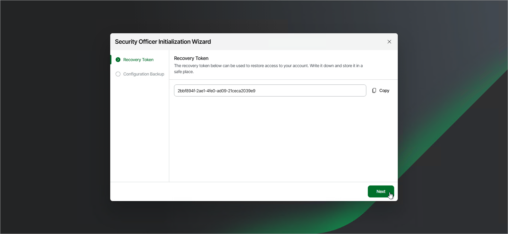
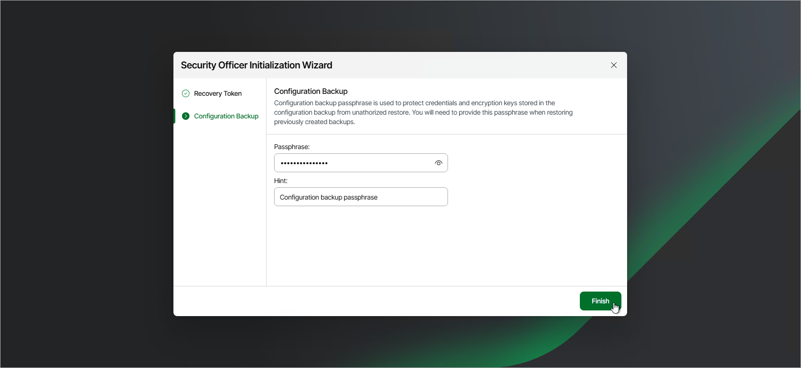

# Performing Initial Security Officer Login

When you first log in to the Veeam Host Management as a Security Officer, perform the following steps:

1. Log in to the Veeam Host Management web UI.
2. Specify a new password that meets the following requirements:

* 15 characters minimum.
* 1 upper case character.
* 1 lower case character.
* 1 numeric character.
* 1 special character.
* No more than 3 characters of the same class in a row. For example, more than 3 lowercase or 3 numerical characters in sequence.

1. Click Next.
2. Configure multi-factor authentication:

1. Open your authentication application. Enter the code or scan the QR code.
2. Specify the one-time code provided by the application.

1. Copy the recovery token and save it in a secure place.

1. Specify a passphrase and a hint to additionally protect sensitive data stored in encrypted configuration backups. For more information, see [Creating Encrypted Configuration Backups](config_backup_encrypted.md) and [Restoring Configuration Database on Linux-Based Backup Server](vbr_config_restore_linux.md).

You can change the passphrase later if required. For more information, see [Managing Configuration Backup Passphrases](hmc_perform_so_tasks.md#manage_bco_passphrase).

1. Click Finish.

