# How to Protect Failover Clusters

In this article

Veeam Backup & Replication lets you deploy and manage Veeam Agent for Microsoft Windows on failover clusters in your infrastructure.

This scenario describes how you can use Veeam Agent to protect failover clusters. For example, Windows File Server Failover Clusters. For the full list of failover cluster types that you can back up with Veeam Agent, see [Failover Cluster Support](agents_cluster_support.md).

|  |
| --- |
| NOTE |
| If you want to back up a a Microsoft Exchange Database Availability Group without an Administrative Access Point (IP Less DAG), follow backup job configuration procedure for standalone servers. To learn more, see [Backup of Database Availability Groups](agents_dag_hiw.md). |

In this scenario, you will:

1. [Create a failover cluster protection group](#group).
2. [Create a failover cluster backup job](#job).

To create a protection group to backup failover clusters:

1. Launch the New Protection Group wizard. Select the Microsoft Active Directory objects protection group type.

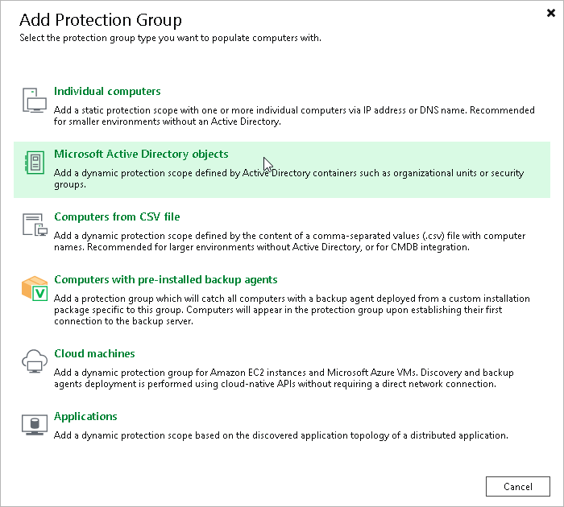

1. At the Name step of the wizard, specify a name and description for the protection group. Click Next.

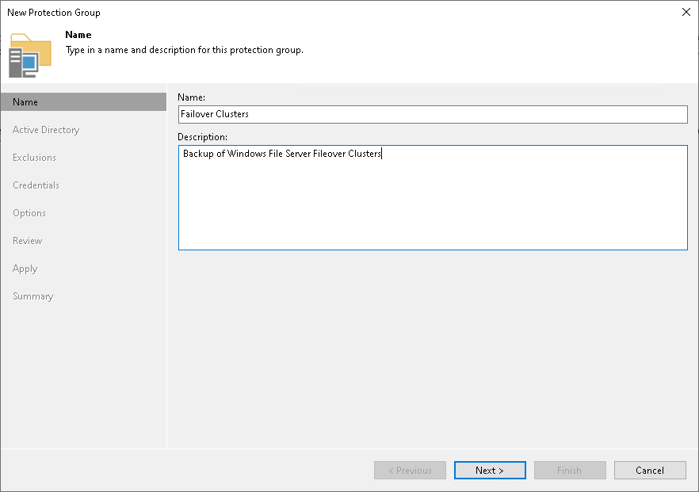

1. At the Active Directory step of the wizard, select failover clusters that you want to add to the protection group. Click Next.

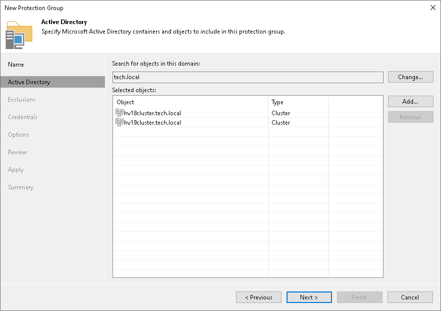

1. At the Exclusions step of the wizard, make sure that none of the required hosts are excluded. Click Next.

1. At the Credentials step of the wizard, specify credentials to connect to each failover cluster. If you want to use the same credentials for all failover clusters, select the necessary user account from the Master account list. If some failover clusters require a different user account, specify custom credentials. Click Next.

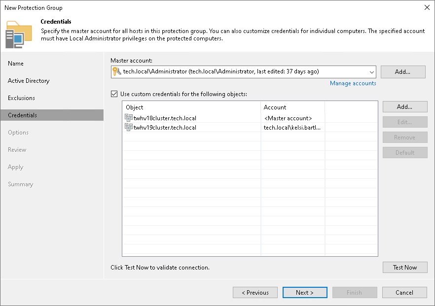

1. At the Options step of the wizard, specify settings for discovery and Veeam Agent deployment. Click Next.

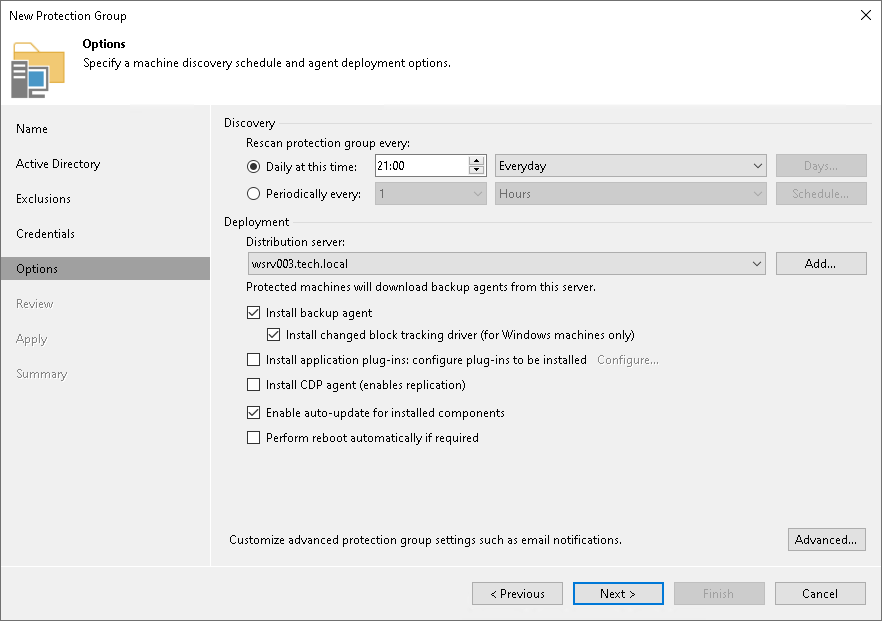

1. At the Review step of the wizard, review what Veeam Backup & Replication components are already installed on the distribution server specified for the protection group and what components will be installed. Click Apply to add the configured protection group to the inventory.

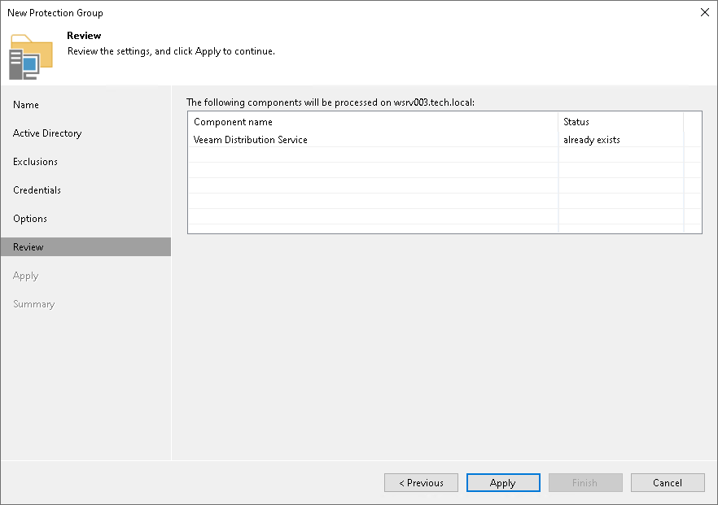

1. At the Apply step of the wizard, wait for the operation of the protection group creation to complete. Click Next.

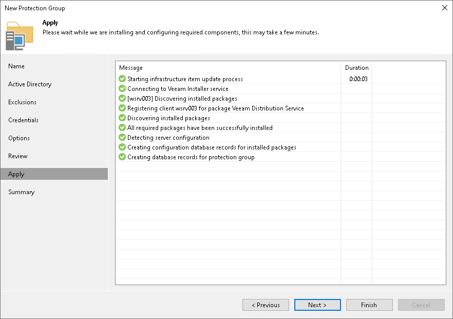

1. At the Summary step of the wizard, review information about the created protection group. Click Finish to close the wizard.

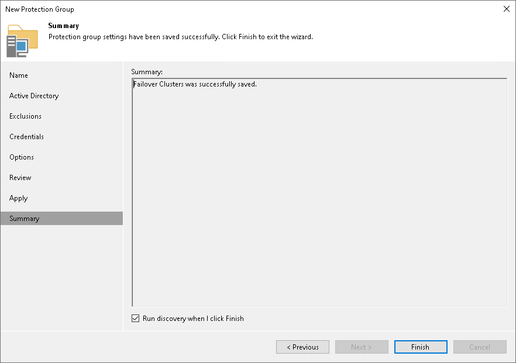

To create a failover cluster backup job:

1. Select Backup Job > Windows computer to launch the New Agent Backup Job wizard.
2. At the Job Mode step of the wizard, in the Type field select Failover Cluster. Click Next.

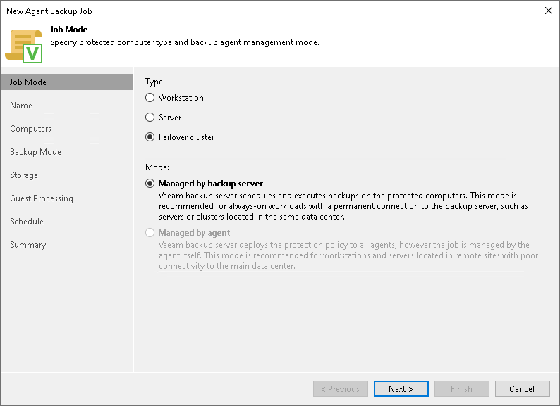

1. At the Name step of the wizard, specify a name and description for the backup job. Click Next.

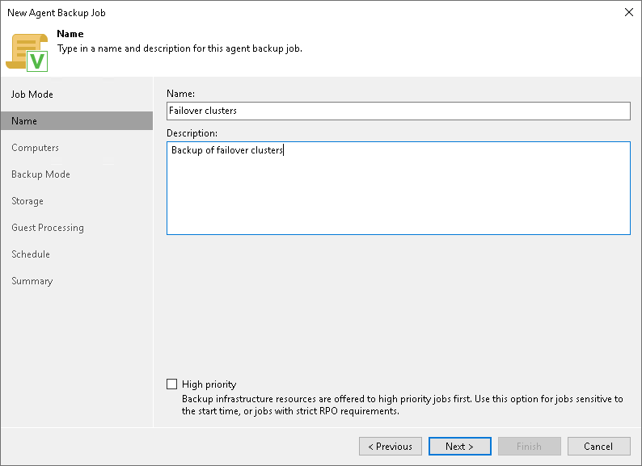

1. At the Computers step of the wizard, select a protection group that contains failover clusters. Click Next.

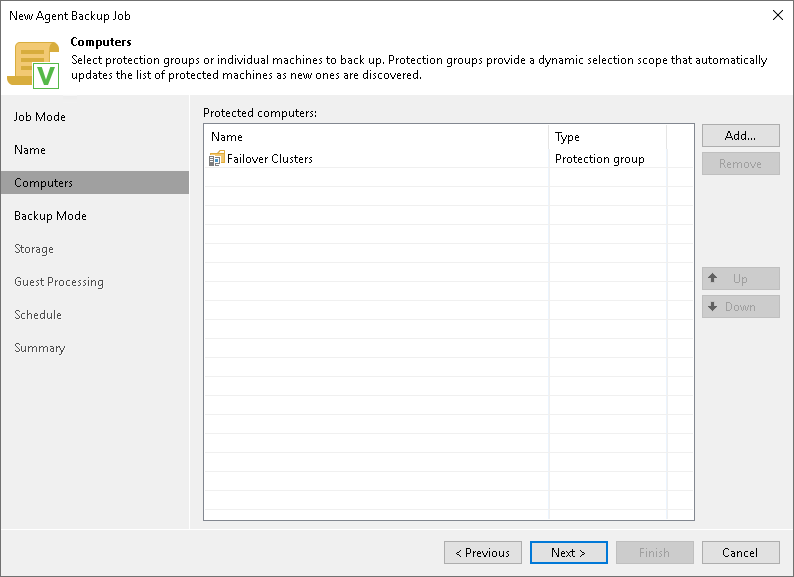

1. At the Backup Mode step of the wizard, select the mode in which you want to create a backup. Click Next.

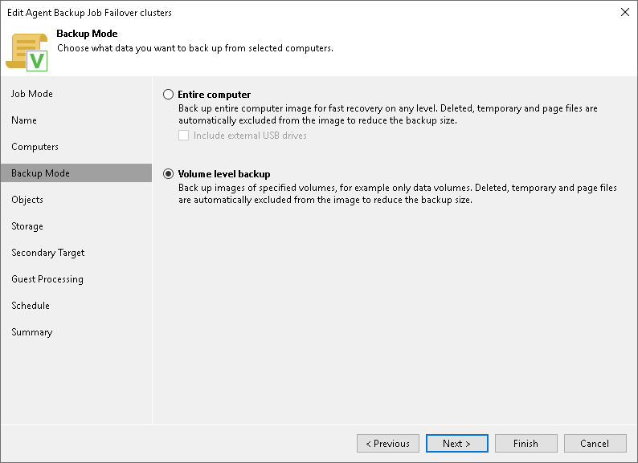

1. [For volume-level backup] At the Objects step of the wizard, specify volumes you want to include in the backup. Click Next.

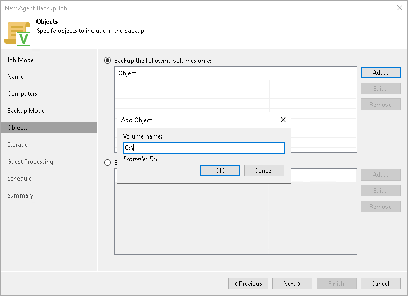

1. At the Storage step of the wizard, specify settings for the target backup repository. Click Next.

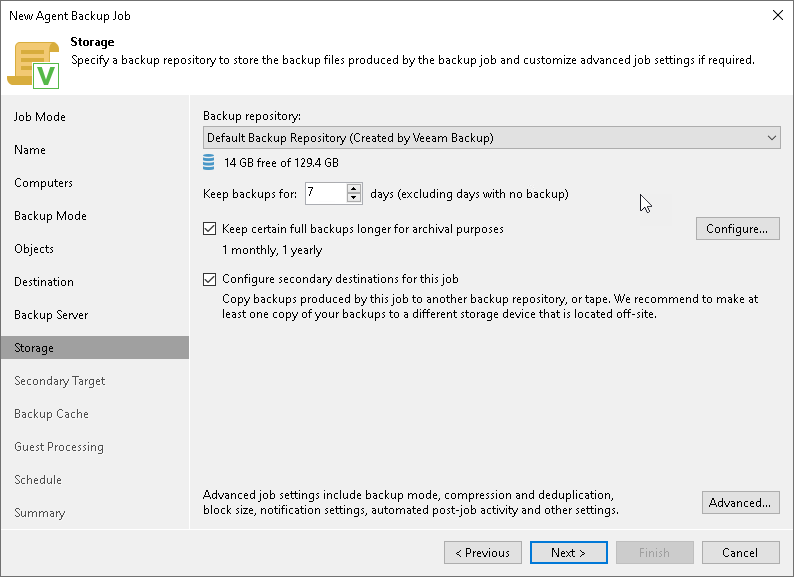

1. [If you selected the Configure secondary destinations for this job check box at the Storage step of the wizard] At the Secondary Target step of the wizard, link the Veeam Agent backup job to a backup to tape or backup copy job. Click Next.

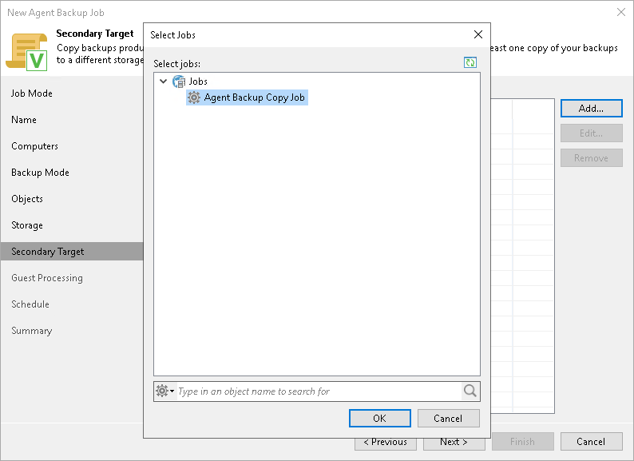

1. At the Guest Processing step of the wizard, specify guest OS processing settings. Click Next.

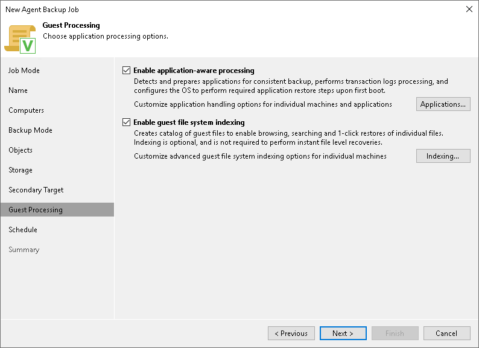

1. At the Schedule step of the wizard, specify the schedule according to which you want to perform backup. Click Apply.

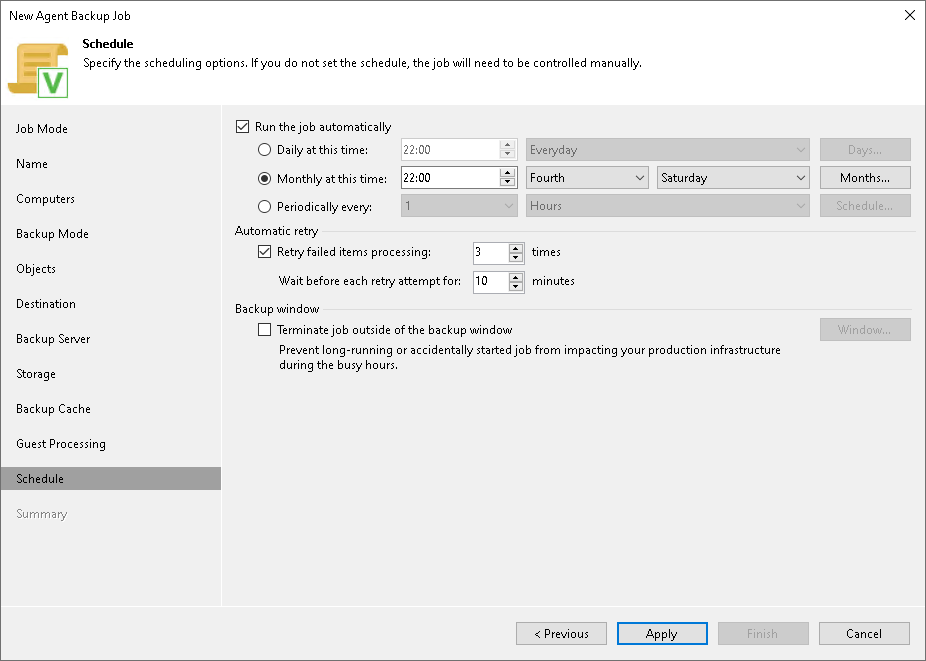

1. At the Summary step of the wizard, review settings of the configured backup job. Click Finish to close the wizard.

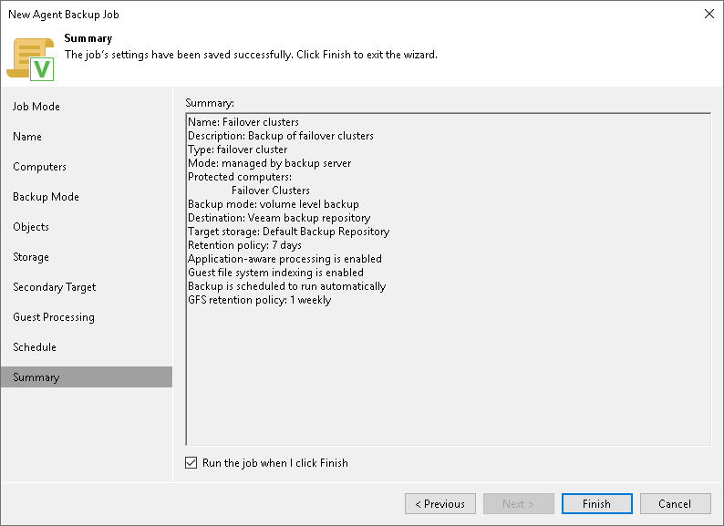

Page updated 5/23/2025

Page content applies to build 13.0.1.1071
