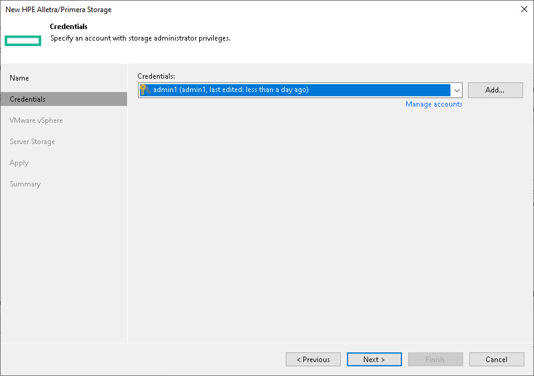

# Step 4. Specify Credentials

At the Credentials step of the wizard, specify credentials for a user account with administrator privileges on the HPE Web Services API Server.

1. From the Credentials list, select credentials to connect to the HPE Web Services API Server. If you have not set up credentials beforehand, click the Manage accounts link or click Add on the right of the Credentials field to add the necessary credentials. For more information, see the [Credentials Manager](credentials_manager.md) section in the Veeam Backup & Replication User Guide.

|  |
| --- |
| Important |
| The user account must have the "edit" user role on the HPE Web Services API Server. |

1. When you add a storage system, Veeam Backup & Replication saves to the configuration database a TLS certificate thumbprint and an SSH key fingerprint of the HPE Web Services API Server. During every subsequent connection to the server, Veeam Backup & Replication uses the saved information to verify the server identity and avoid the man-in-the-middle attack.

If the certificate installed on the server is not trusted, Veeam Backup & Replication displays a warning.

+ To view detailed information about the certificate, click View.
+ If you do not trust the server, click Cancel.

Veeam Backup & Replication will display an error message, and you will not be able to connect to the server.

* If you trust the server, click Continue.

Veeam Backup & Replication will display the SSH key fingerprint. To accept the fingerprint and connect to the server, click Yes.

When you update a certificate or SSH key on a server, this server becomes unavailable in the Veeam Backup & Replication console. To make the server available again, acknowledge the new certificate or SSH key at the Credentials step of the edit storage system wizard.

