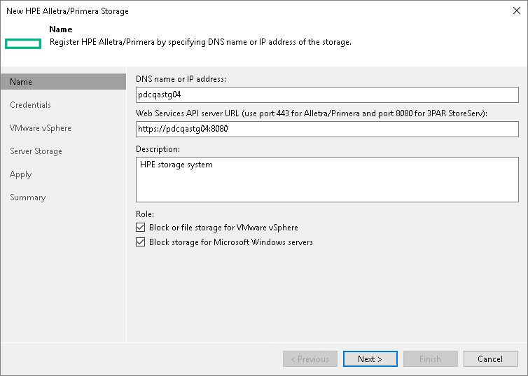

# Step 3. Specify HPE Web Services API Address and Storage Role

Veeam Backup & Replication uses the HPE Web Services API to work with HPE Alletra Storage MP B10000, 9000, Primera, 3PAR storage systems. The HPE Web Services API delivers a programming interface for performing storage management tasks.

At the Name step of the wizard, provide information about the HPE Web Services API Server, provide a description and storage role.

1. In the DNS name or IP address field, enter a full DNS name, or IPv4 or IPv6 address of the server. Note that you can use IPv6 addresses only if IPv6 communication is enabled as described in the [IPv6 Support](ipv6.md) section in the Veeam Backup & Replication User Guide.
2. In the Web Services API server URL field, enter a URL of the HPE Web Services API Server. Use the following URLs:

[For Alletra Storage MP B10000, 9000, Primera] https://< websapiserver>:443

[For 3PAR StoreServ] https://< websapiserver>:8080

where <websapiserver> is the name or IP address of the HPE Web Services API Server.

|  |
| --- |
| Note |
| If you add the storage system using an IPv6 address, make sure that the IP part is enclosed in square brackets: https://[< websapiserver>]:443. |

1. In the Description field, provide a description for future reference. The default description contains information about the user who added the server, date and time when the server was added.
2. In the Role section, select the types of backup jobs that are allowed to access this storage system:

1. Select the Block or file storage for VMware vSphere check box to allow VMware backup.
2. Select the Block storage for Microsoft Windows servers check box to allow backup of Veeam Agents.

When you select any of these check boxes, additional steps of the wizard will appear.

If you do not select any check box, Veeam Backup & Replication displays an error. To proceed with the wizard, select at least one check box.

