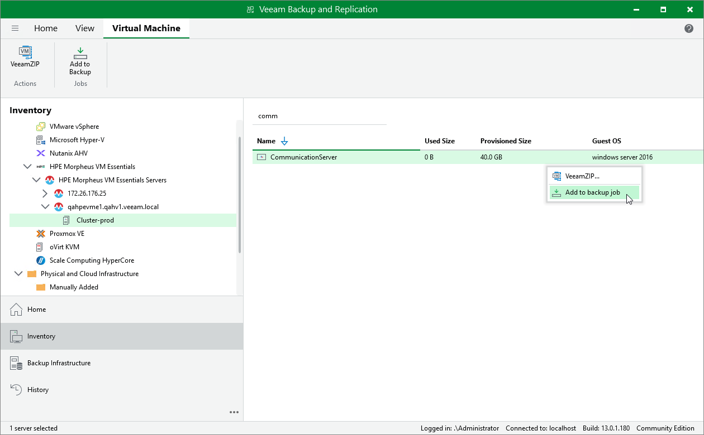

# Adding VMs to Job

If you want to protect additional VMs by configured jobs, you can either [edit the backup job settings](hpe_backup_job_edit.md), or quickly add the VMs to the jobs from the Inventory view.

|  |
| --- |
| Note |
| If a VM is already added to the exclusion list in the job, the VM will not be protected. |

To add a VM to a backup job, do the following:

1. Open the Inventory view.
2. In the inventory pane, select Virtual Infrastructure.
3. In the working area, right-click the VM that you want to protect, select Add to backup job and choose the necessary job.

Alternatively, select the VM, click Add to Backup on the ribbon and choose the necessary job.

|  |
| --- |
| Tip |
| To create a new job, select New job and configure a new job as described in section [Creating Backup Jobs](hpe_backup_job_create.md). |

Page updated 2026-07-22

