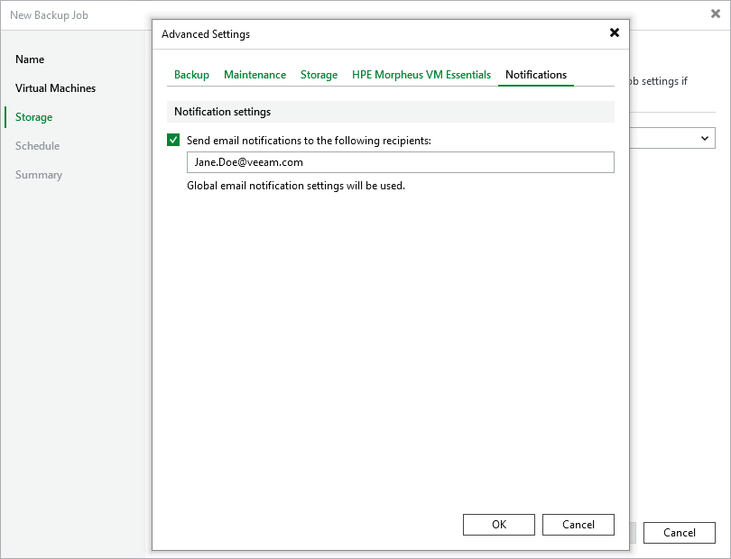

# Configuring Advanced Settings

In the Advanced settings window, you can schedule full backups, configure health check settings, specify backup file storage settings and enable email notifications.

Backup Settings

To instruct Veeam Backup & Replication to create full backups according to a specific schedule, switch to the Backup tab and do the following:

1. To [schedule synthetic full backups](hpe_synthetic_full_backup.md), select the Create synthetic full backups periodically check box, click Configure and choose whether you want to create these backups on specific days on a weekly or monthly basis.
2. To [schedule active full backups](hpe_active_full_backup.md), select the Create active full backups periodically check box, click Configure and choose whether you want to create these backups on specific days on a weekly or monthly basis.

Alternatively, you can create active full backups manually when needed. For more information, see [Creating Active Full Backups](hpe_active_full_create.md).

|  |
| --- |
| Important |
| * Synthetic full backups cannot be scheduled if an object storage repository is selected as the target location for backups. * Do not schedule synthetic and active full backups to run at the same time. Due to technical limitations, Veeam Backup & Replication will be unable to create synthetic full backups according to the specified schedule. |

Health Check Settings

To instruct Veeam Backup & Replication to periodically [perform a health check](hpe_how_health_check_works.md) for backups, switch to the Maintenance tab, select the Perform backup files health check (detects and auto-heals corruption) check box and click Configure and specify a schedule for the health check to run.

|  |
| --- |
| Important |
| * It is recommended that the backup and health check schedules configured for the job do not overlap to avoid data access issues. * If you have selected an off-premise cloud object storage repository as the target location for backups at [step 4](hpe_backup_job_create_destination.md), it is recommended that a [helper appliance is configured in the repository settings](compatible_mount_server.md). Otherwise, additional data transfer costs may occur. |

Storage Settings

To specify storage settings for backup files created by the backup job, switch to the Storage tab and do the following:

1. To decrease the size of the files, select a compression level from the Compression level drop-down list (None, Dedupe-friendly, Optimal, High or Extreme). For more information on data compression, see [Compression and Deduplication](compression_deduplication.md).
2. To optimize job performance and storage usage, select a block size from the Storage optimization drop-down list. Veeam Backup & Replication will use this size to "split" VM images into separate data blocks when processing VMs — the more data blocks there are, the more time is required to process the VM images. For more information on how data block sizes affect performance, see section [Storage Optimization](compression_deduplication.md).

|  |
| --- |
| Note |
| By default, Veeam Backup & Replication [enables deduplication](compression_deduplication.md) for backed-up data. Due to technical limitations, you cannot disable it while configuring backup jobs. |

Guest Quiescence Settings

To instruct Veeam Backup & Replication to freeze applications running on Windows VMs while snapshots are taken, switch to the HPE Morpheus VM Essentials tab, select the Enable QEMU Guest Agent quiescence check box. Keep in mind that Veeam Backup & Replication requires the QEMU Guest Agent tool to be installed manually on the processed VMs before the backup job starts.

Notification Settings

To instruct Veeam Backup & Replication to send email notifications on the backup job results, switch to the Notifications tab, select the Send email notifications check box and specify an email address of a recipient; use a semicolon to separate multiple recipient addresses. For Veeam Backup & Replication to be able to send email notifications, you must configure a mail server as described in section [Configuring Email Settings](hpe_email_settings.md).

|  |
| --- |
| Note |
| Email notifications on the backup job results will be also sent to recipients configured in the [global notification settings](hpe_notifications.md). |

