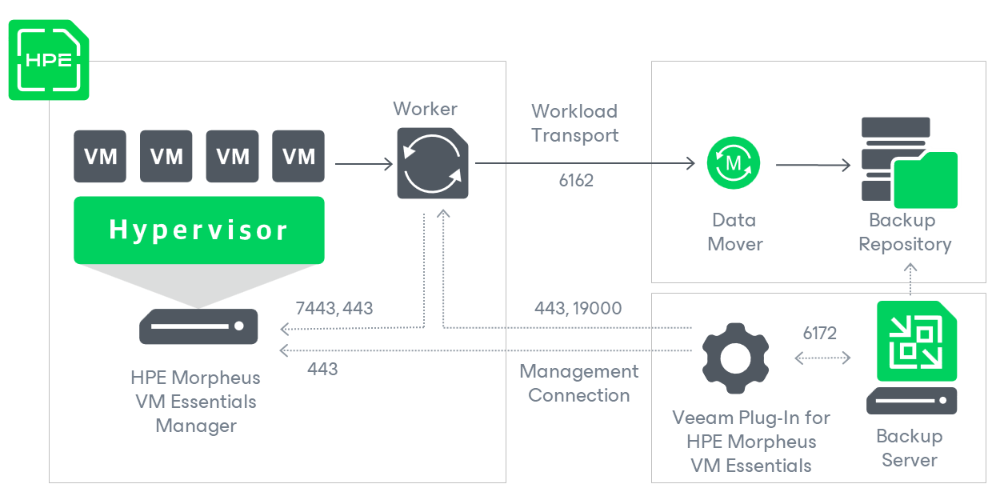

# Solution Architecture

Since Veeam Plug-in for HPE Morpheus VM Essentials is integrated with Veeam Backup & Replication, the solution architecture comprises the following set of components:

* [HPE Morpheus VM Essentials manager](#cluster)
* [Backup server](#server)
* [Veeam Plug-in for HPE Morpheus VM Essentials](#plugin)
* [Backup repositories](#repositories)
* [Workers](#workers)

HPE Morpheus VM Essentials Manager

A HPE Morpheus VM Essentials manager is a software appliance that provides a centralized interface for managing multiple clusters in the HPE Morpheus VM Essentials environment. Veeam Plug-in for HPE Morpheus VM Essentials uses the manager to access such resources as datastores, networks and VMs while performing backup and restore operations.

Backup Server

A backup server is either a Windows-based or Linux-based physical or virtual machine on which Veeam Backup & Replication is installed. The backup server is the configuration, administration and management core of the backup infrastructure. It coordinates backup and restore operations, controls job scheduling and manages resource allocation.

Veeam Plug-In for HPE Morpheus VM Essentials

Veeam Plug-in for HPE Morpheus VM Essentials is an architecture component that enables integration between the backup server and other components of the backup infrastructure. Veeam Plug-in for HPE Morpheus VM Essentials allows Veeam Backup & Replication to connect to the HPE Morpheus VM Essentials manager, and to perform data protection and disaster recovery tasks with HPE Morpheus VM Essentials resources.

Backup Repositories

A backup repository is a storage location where Veeam Backup & Replication stores backups of protected HPE Morpheus VM Essentials VMs.

To communicate with backup repositories, Veeam Backup & Replication uses Veeam Data Mover — the service that is responsible for data processing and transfer. By default, Veeam Data Mover runs on the repositories themselves. If a repository cannot host Veeam Data Mover, it starts on a gateway server — a dedicated component that “bridges” the backup server and workers. For more information, see [Gateway Servers](gateway_server.md).

Workers

A worker is a Linux-based VM that resides in the HPE Morpheus VM Essentials cluster and processes backup workloads when transferring data to and from backup repositories.

