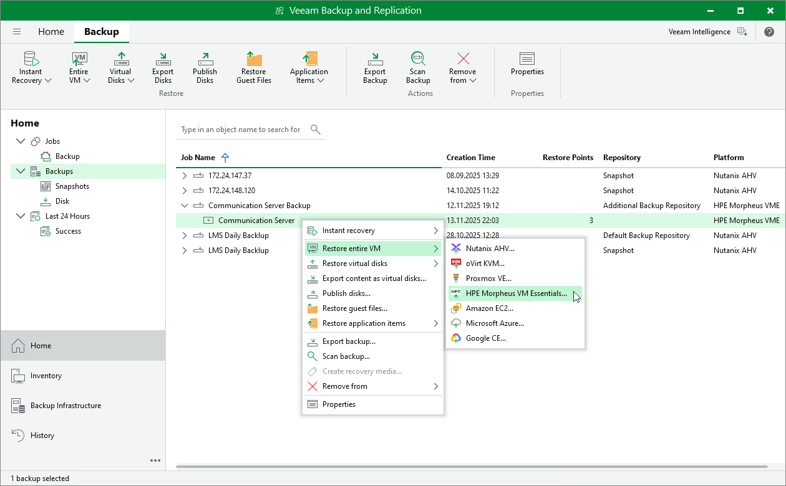

# Step 1. Launch Entire VM Restore Wizard

To launch the Full VM Restore wizard, do the following:

1. Open the Home view.
2. In the inventory pane, select Backups.
3. In the working area, expand the necessary backup job, right-click the VM you want to restore and select Restore entire VM > HPE Morpheus VM Essentials.

Alternatively, expand the necessary backup job, select the VM and click Entire VM > HPE Morpheus VM Essentials on the ribbon.

Page updated 2026-07-22

