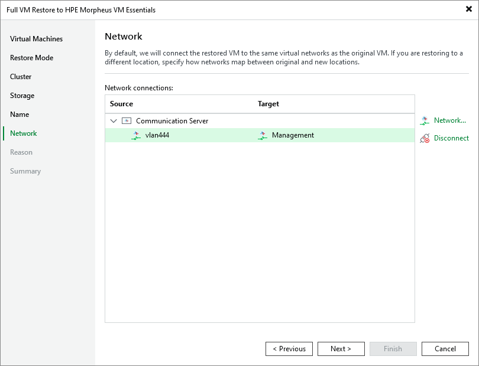

# Step 7. Configure Network Settings

[This step applies only if you have selected the Restore to a new location, or with different settings option at the Restore Mode step of the wizard]

At the Network step of the wizard, choose a network to which the recovered VM will be connected. For a network to be displayed in the list of available networks, it must be configured in the virtual environment as described in [HPE Morpheus VM Essentials documentation](https://support.hpe.com/hpesc/public/docDisplay?docId=sd00007370en_us&page=GUID-451A0EAA-D2AF-4529-AEF0-9543A638CE03.html).

|  |
| --- |
| Tip |
| By default, Veeam Backup & Replication will try to connect each recovered VM to the original network. If you restore multiple VMs at a time and you want to specify new networks, you can click Disconnect to clear target networks for all VMs at once. Then, you will have to specify a new network for each VM to proceed. |

