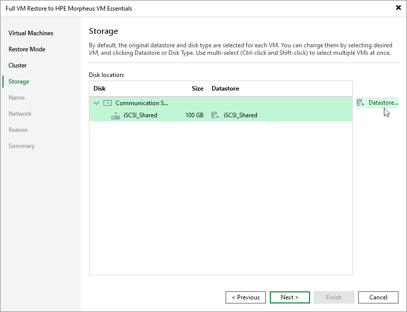

# Step 5. Select Storage

[This step applies only if you have selected the Restore to a new location, or with different settings option at the Restore Mode step of the wizard]

At the Storage step of the wizard, choose a datastore where virtual disks of the recovered VM will be stored. For a datastore to be displayed in the list of available storage, it must be configured in the virtual environment as described in [HPE Morpheus VM Essentials documentation](https://support.hpe.com/hpesc/public/docDisplay?docId=sd00006774en_us&page=GUID-D3548220-4D77-4DBB-8313-CFAD68416264.html).

If you restore the VM to the original host, Veeam Backup & Replication will automatically select the same datastore where the original VM disks were stored at the moment of backup. If you restore the VM to a new host, you will have to select a datastore manually.

