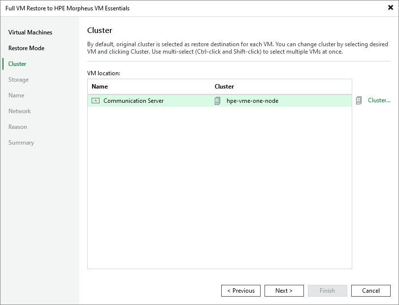

# Step 4. Specify Target Cluster

[This step applies only if you have selected the Restore to a new location, or with different settings option at the Restore Mode step of the wizard]

At the Cluster step of the wizard, choose a cluster to which the recovered VM will belong. For a cluster to be displayed in the list of available clusters, it must be added to the backup infrastructure as described in [Connecting HPE Morpheus VM Essentials manager](hpe_connecting_manager.md).

