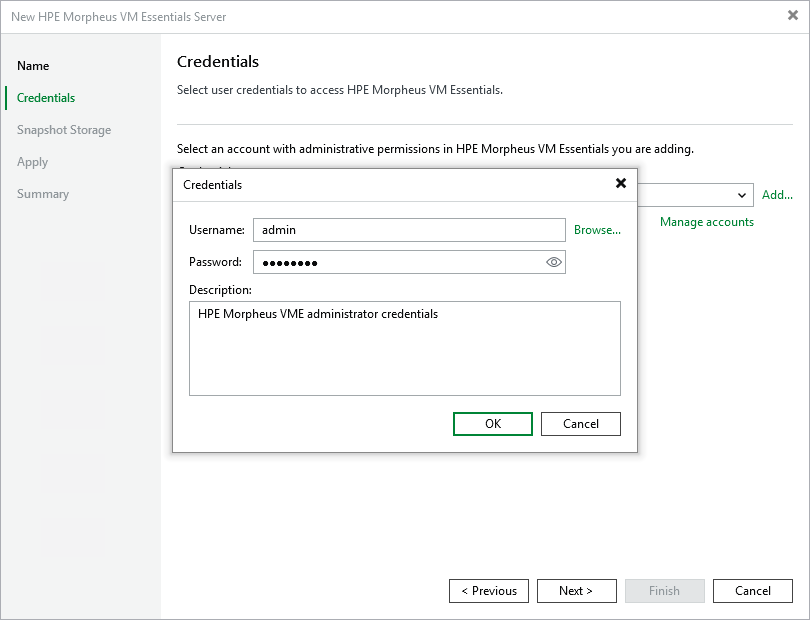

# Step 3. Enter Credentials

At the Credentials step of the wizard, specify credentials for an administrator account with the System Admin role that is used to access the cluster or HPE Morpheus VM Essentials manager. For more information on system roles, see [HPE Morpheus VM Essentials documentation](https://support.hpe.com/hpesc/public/docDisplay?docId=sd00007370en_us&page=GUID-BB3046E2-F2D4-4B45-8B85-E4982E255B2F.html).

For credentials to be displayed in the Credentials list, they must be added to the Credentials Manager as described in section [Standard Accounts](credentials_manager_windows.md). If you have not added the necessary credentials to the Credentials Manager beforehand, you can do this without closing the wizard.

After you click Next, the backup server will connect to the HPE Morpheus VM Essentials manager and check its TLS certificate. If the certificate is not installed on the backup server, the Certificate Security Alert Window will display a warning notifying that secure communication cannot be guaranteed. To allow the backup server to connect to the HPE Morpheus VM Essentials manager using the certificate, click Continue.

