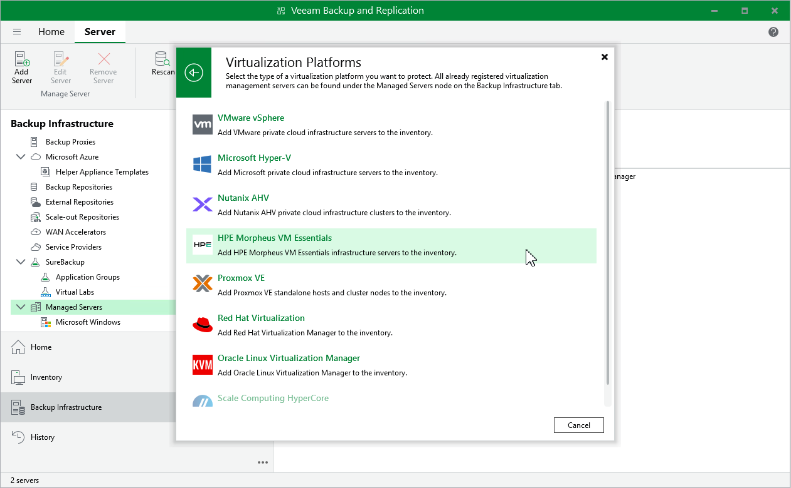

# Step 1. Launch New HPE Morpheus VM Essentials Server Wizard

To launch the New HPE Morpheus VM Essentials Server wizard, do the following:

1. In the Veeam Backup & Replication console, open the Backup Infrastructure view.
2. In the inventory pane, select Managed Servers.
3. On the ribbon, click Add Server.
4. In the Add Server window, select Virtualization Platforms.

1. In the Virtualization Platforms window, select HPE Morpheus VM Essentials to launch the New HPE Morpheus VM Essentials Server wizard.

