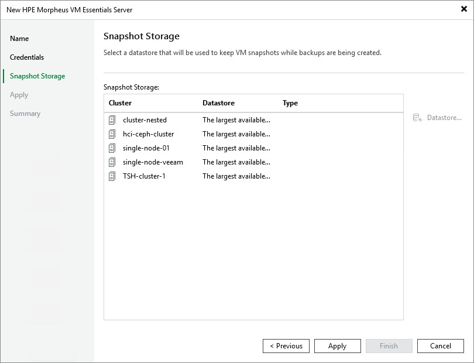

# Step 4. Configure Storage Settings

At the Snapshot Storage step of the wizard, choose whether you want to keep snapshots of processed VMs in a specific datastore or in the largest file-level datastore available on the connected HPE Morpheus VM Essentials manager.

Note that only the Directory Pool, NFS Pool and GFS2 Pool (Global File System 2) datastores are supported. For more information on how to create datestores, see [HPE Morpheus VM Essentials documentation](https://support.hpe.com/hpesc/public/docDisplay?docId=sd00007370en_us&page=GUID-451A0EAA-D2AF-4529-AEF0-9543A638CE03.html).

