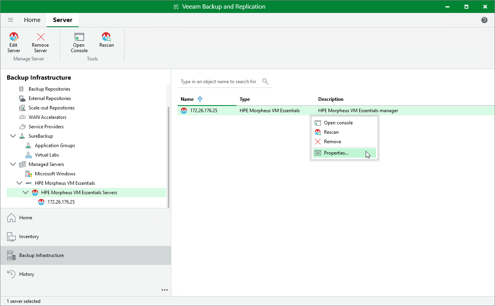

# Editing HPE Morpheus VM Essentials Server Properties

To edit properties of the HPE Morpheus VM Essentials manager added to the backup infrastructure, do the following:

1. Open the Backup Infrastructure view.
2. In the inventory pane, select Managed Servers > HPE Morpheus VM Essentials.
3. In the working area, select the HPE Morpheus VM Essentials manager and click Edit Server on the ribbon, or right-click the HPE Morpheus VM Essentials manager and select Properties.
4. Complete the Edit HPE Morpheus VM Essentials Server wizard as described in section [Adding HPE Morpheus VM Essentials manager to Backup Infrastructure](hpe_sever_add.md).

