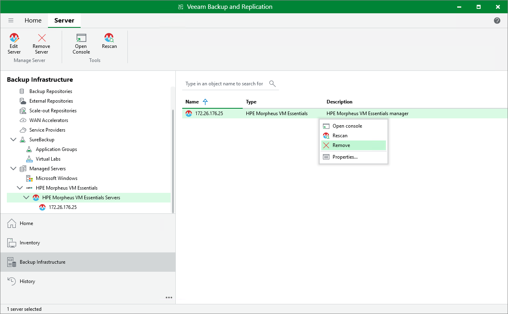

# Removing HPE Morpheus VM Essentials Server

If you do not want to protect resources managed by the connected HPE Morpheus VM Essentials manager anymore, you can remove it from the backup infrastructure.

|  |
| --- |
| Note |
| If you remove the HPE Morpheus VM Essentials manager from the backup infrastructure, Veeam Backup & Replication will also remove workers and worker VM images from the HPE Morpheus VM Essentials clusters. |

To remove the HPE Morpheus VM Essentials manager from the backup infrastructure:

1. Open the Backup Infrastructure view.
2. In the inventory pane, select Managed Servers > HPE Morpheus VM Essentials > HPE Morpheus VM Essentials Servers.
3. In the working area, select the HPE Morpheus VM Essentials manager and click Remove Server on the ribbon, or right-click the HPE Morpheus VM Essentials manager and select Remove.

