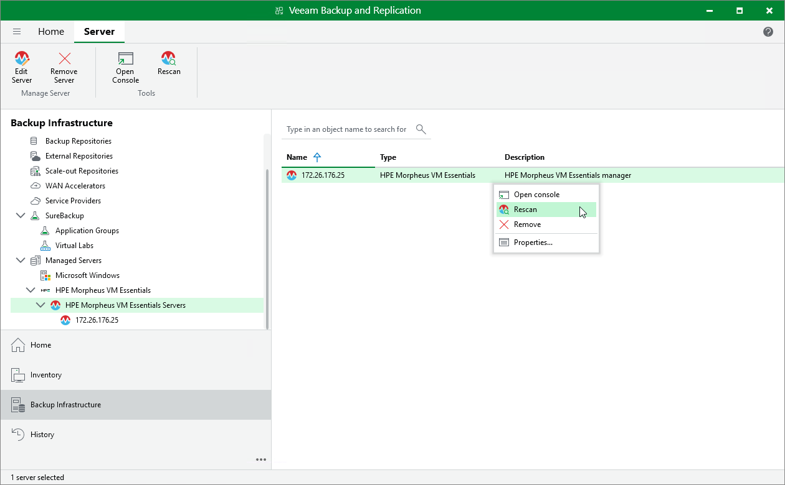

# Rescanning HPE Morpheus VM Essentials Server

Veeam Backup & Replication retrieves information about the HPE Morpheus VM Essentials environment from the HPE Morpheus VM Essentials manager. However, the data synchronization process may take some time to complete. If you make any changes to the HPE Morpheus VM Essentials environment and want the Veeam Backup & Replication console to display the changes immediately, you can rescan the HPE Morpheus VM Essentials manager manually.

To rescan the HPE Morpheus VM Essentials manager, do the following:

1. Open the Backup Infrastructure view.
2. In the inventory pane, select Managed Servers > HPE Morpheus VM Essentials > HPE Morpheus VM Essentials Servers.
3. In the working area, select the HPE Morpheus VM Essentials manager and click Rescan on the ribbon, or right-click the HPE Morpheus VM Essentials manager and select Rescan.

