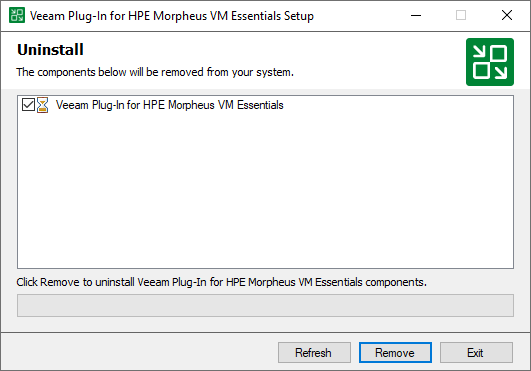

# Uninstalling Veeam Plug-In for HPE Morpheus VM Essentials

[This section does not apply to Linux-based backup server]

|  |
| --- |
| Tip |
| Before you uninstall Veeam Plug-in for HPE Morpheus VM Essentials, it is recommended that you [remove the HPE Morpheus VM Essentials manager](hpe_server_remove.md) from the backup infrastructure. In this case, Veeam Backup & Replication will also remove workers and worker images from the connected HPE Morpheus VM Essentials clusters. |

To uninstall Veeam Plug-in for HPE Morpheus VM Essentials, do the following:

1. Log in to the backup server using an account with the Local Administrator permissions.
2. Open the Start menu and click the Settings icon.
3. In the Settings window, navigate to System > Apps and Features.
4. In the program list, select Veeam Plug-in for HPE Morpheus VM Essentials. Then, click Uninstall.
5. In the opened window, click Remove.

