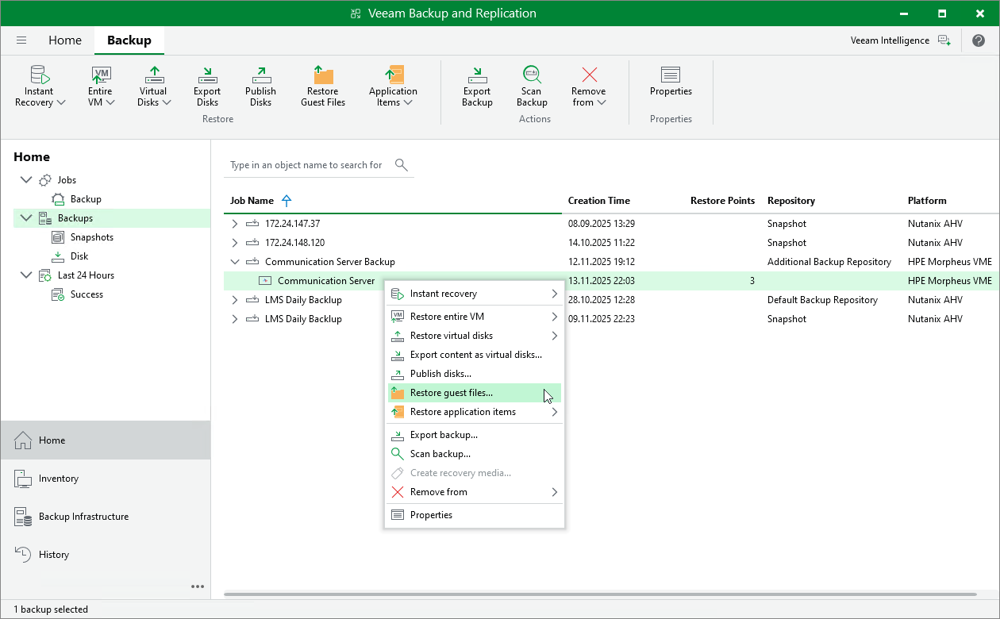

# Performing File-Level Restore

With guest OS file recovery (file-level restore), you can restore individual guest OS files and folders from VM backups created with Veeam Plug-in for HPE Morpheus VM Essentials. When restoring files and folders, you do not need to extract the VM image to a staging location or start the VM prior to restore. For more information on VM guest OS file restore, see [Guest OS File Recovery](guest_file_recovery.md).

|  |
| --- |
| Note |
| To be able to restore files and folders to the original location, you will need to install the [QEMU Guest Agent](https://wiki.qemu.org/Features/GuestAgent) on the target VM. |

To restore VM guest OS files and folders, do the following:

1. Open the Home view.
2. In the inventory pane, select Backups.
3. In the working area, expand the necessary backup job, right-click the VM that contains files you want to restore and select Restore guest files.

Alternatively, expand the necessary backup job, select the VM click Restore Guest Files on the ribbon.

1. Complete the File Level Restore wizard as described in section [Recovering Guest OS Files Using Console](performing_guest_restore.md).

|  |
| --- |
| Note |
| Depending on the operating system of a VM whose files and folders you want to restore, Veeam Backup & Replication may require a [mount server](guest_file_recovery.md) — a server that will be used to mount VM disks. While completing the File Level Restore wizard, you will be able either to choose a server already added to the backup infrastructure or to specify connection settings of a new server that will used as the mount server. For more information on how Veeam Backup & Replication selects mount servers, see [Mount Server Automatic Selection](guest_restore_scenarios.md). |

